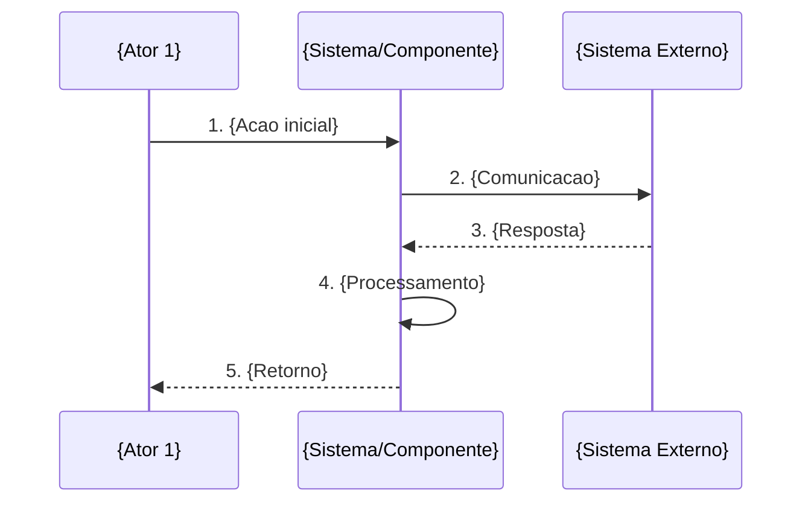

# Criar caso de uso

Criar um documento de caso de uso completo seguindo o template e padroes definidos.

## Argumentos

$ARGUMENTS

## Passos

1. Identificar o dominio do caso de uso (AUTH, LEAD, CONV, SCORE, IA, DASH, EXT, WS, ANL, NOTIF, INT ou outro).
2. Determinar o proximo ID disponivel no padrao `UC-{DOMINIO}-{NUMERO}`.
3. Criar o documento em Markdown usando o template.
4. Perguntar onde salvar o arquivo se o caminho nao estiver claro.

## Template de caso de uso

```markdown
# UC-{ID}: {Nome do Caso de Uso}

## Informacoes Gerais

| Campo          | Valor                                    |
|----------------|------------------------------------------|
| **ID**         | UC-{ID}                                  |
| **Nome**       | {Nome descritivo}                        |
| **Dominio**    | {Nome do dominio}                        |
| **Prioridade** | {Alta/Media/Baixa}                       |
| **Versao**     | 1.0                                      |
| **Status**     | Rascunho                                 |

---

## 1. Descricao

{Descricao clara e concisa do que o caso de uso faz, seu proposito e contexto de negocio.}

---

## 2. Atores

| Ator                  | Tipo     | Descricao                                          |
|-----------------------|----------|----------------------------------------------------|
| {Ator Principal}      | Primario | {Descricao do papel}                               |
| {Ator Secundario}     | Sistema  | {Descricao do papel}                               |

---

## 3. Pre-condicoes

1. {Pre-condicao 1}
2. {Pre-condicao 2}
3. {Pre-condicao N}

---

## 4. Pos-condicoes

### Sucesso
- {Resultado esperado 1}
- {Resultado esperado 2}
- Log de operacao registrado

### Falha
- Log de erro registrado com detalhes
- {Acao de recuperacao}
- Notificacao enviada se erro critico

---

## 5. Fluxo Principal



### Passos Detalhados

| Passo | Acao                                                                |
|-------|---------------------------------------------------------------------|
| 1     | {Descricao detalhada do passo 1}                                    |
| 2     | {Descricao detalhada do passo 2}                                    |
| N     | {Descricao detalhada do passo N}                                    |

---

## 6. Fluxos Alternativos

### FA1: {Nome do fluxo alternativo 1}

| Passo | Condicao                        | Acao                                    |
|-------|---------------------------------|-----------------------------------------|
| Xa    | {Condicao de desvio}            | {Acao alternativa}                      |
| Xb    | -                               | {Continuacao}                           |

### FA2: {Nome do fluxo alternativo 2}

| Passo | Condicao                        | Acao                                    |
|-------|---------------------------------|-----------------------------------------|
| Ya    | {Condicao de desvio}            | {Acao alternativa}                      |
| Yb    | -                               | {Continuacao}                           |

---

## 7. Excecoes

| Codigo | Excecao                         | Tratamento                           |
|--------|---------------------------------|--------------------------------------|
| E001   | {Tipo de excecao}               | {Como tratar}                        |
| E002   | {Tipo de excecao}               | {Como tratar}                        |
| E003   | Timeout na comunicacao          | Retry com backoff exponencial        |

---

## 8. Regras de Negocio

| ID   | Regra                                                                              |
|------|------------------------------------------------------------------------------------|
| RN01 | {Regra de negocio 1}                                                               |
| RN02 | {Regra de negocio 2}                                                               |
| RN03 | {Regra de negocio N}                                                               |

### Detalhamento RN{X} - {Nome da regra complexa}

{Se alguma regra precisar de detalhamento adicional, incluir aqui com:}
- Descricao expandida
- Tabela de valores permitidos
- Pseudocodigo se necessario
- Diagramas de decisao (mermaid flowchart)

---

## 9. Requisitos Nao-Funcionais

| ID    | Requisito                                                     |
|-------|---------------------------------------------------------------|
| RNF01 | {Performance: tempo de resposta, throughput}                  |
| RNF02 | {Disponibilidade/SLA}                                         |
| RNF03 | {Retry e resiliencia}                                         |
| RNF04 | {Logging e auditoria}                                         |

---

## 10. Dados Tecnicos

### Mapeamento de Campos: {Origem} -> {Destino}

| Campo Origem    | Campo Destino    | Tipo          | Obrigatorio | Observacao           |
|-----------------|------------------|---------------|-------------|----------------------|
| {campo1}        | {CAMPO1}         | VARCHAR(100)  | Sim         | {Nota}               |
| {campo2}        | {CAMPO2}         | INT           | Nao         | {Nota}               |

### Endpoint {Sistema} - {Operacao}

```http
{METHOD} {URL}
Authorization: Bearer {token}
Content-Type: application/json
```

### Request Body

```json
{
  "campo1": "valor",
  "campo2": 123
}
```

### Response (Sucesso)

```json
{
  "status": "success",
  "data": {}
}
```

### Response (Erro)

```json
{
  "status": "error",
  "code": "ERROR_CODE",
  "message": "Descricao do erro"
}
```

---

## 11. Estrutura de Dados

```json
{
  "id": "string",
  "campo": "valor"
}
```

Ou schema SQL:

```sql
CREATE TABLE {NomeTabela} (
    Id INT PRIMARY KEY,
    Campo VARCHAR(100)
);
```

---

## 12. Casos de Teste

| ID   | Cenario                              | Entrada                           | Resultado Esperado               |
|------|--------------------------------------|-----------------------------------|----------------------------------|
| CT01 | {Cenario de sucesso basico}          | {Dados validos}                   | {Resultado esperado}             |
| CT02 | {Cenario alternativo}                | {Dados variacao}                  | {Resultado esperado}             |
| CT03 | {Cenario de erro}                    | {Dados invalidos}                 | {Erro esperado}                  |
| CT04 | {Cenario de borda}                   | {Dados limite}                    | {Comportamento esperado}         |

---

## 13. Metricas e Monitoramento

| Metrica                      | Descricao                                |
|-----------------------------|-------------------------------------------|
| {operacao}_total            | Total de operacoes realizadas             |
| {operacao}_duration         | Duracao media da operacao                 |
| {operacao}_errors           | Erros durante operacao                    |
| {operacao}_success_rate     | Taxa de sucesso                           |

---

## 14. Dependencias

| Caso de Uso  | Relacao      | Descricao                              |
|-------------|--------------|----------------------------------------|
| UC-{XX}-{N} | Depende de   | {O que e necessario}                   |
| UC-{XX}-{N} | Estende      | {O que e estendido}                    |
| UC-{XX}-{N} | Inclui       | {O que e incluido}                     |
| UC-{XX}-{N} | Usado por    | {Quem usa este UC}                     |

---

## 15. Referencias

- [{Nome do documento}]({caminho relativo})
- [{Documentacao externa}]({URL se aplicavel})

---

*Criado em: {DATA ATUAL no formato YYYY-MM-DD}*
*Ultima atualizacao: {DATA ATUAL no formato YYYY-MM-DD}*
```

## Diretrizes de qualidade

- Preencher todas as secoes relevantes; remover o que nao se aplica.
- Ser claro e objetivo; evitar ambiguidades.
- Manter nomenclatura consistente.
- Usar Mermaid para diagramas.
- Incluir exemplos realistas de payloads.
- Cobrir testes de sucesso, erro e edge cases.
- Documentar transformacoes de dados quando houver integracao.

## Saida esperada

Gerar documento de caso de uso completo em Markdown, pronto para salvar no diretorio de documentacao do projeto.
