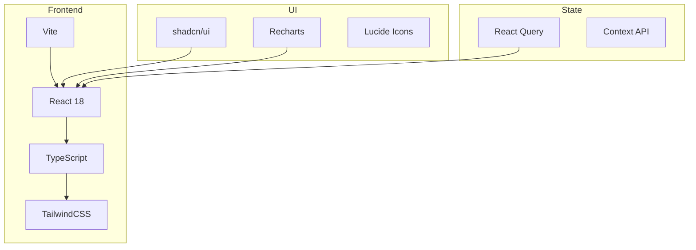
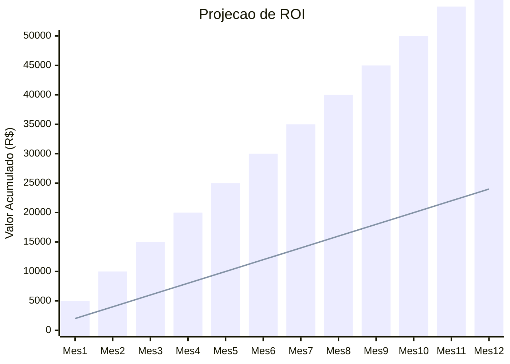
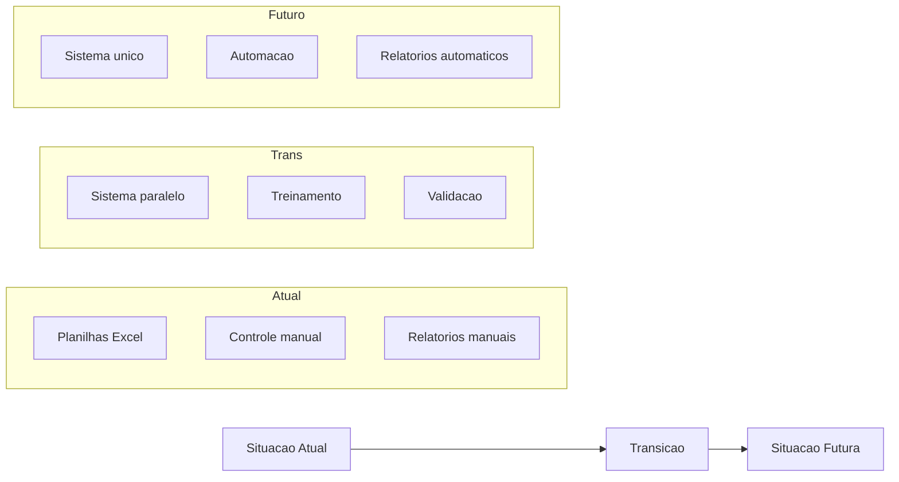
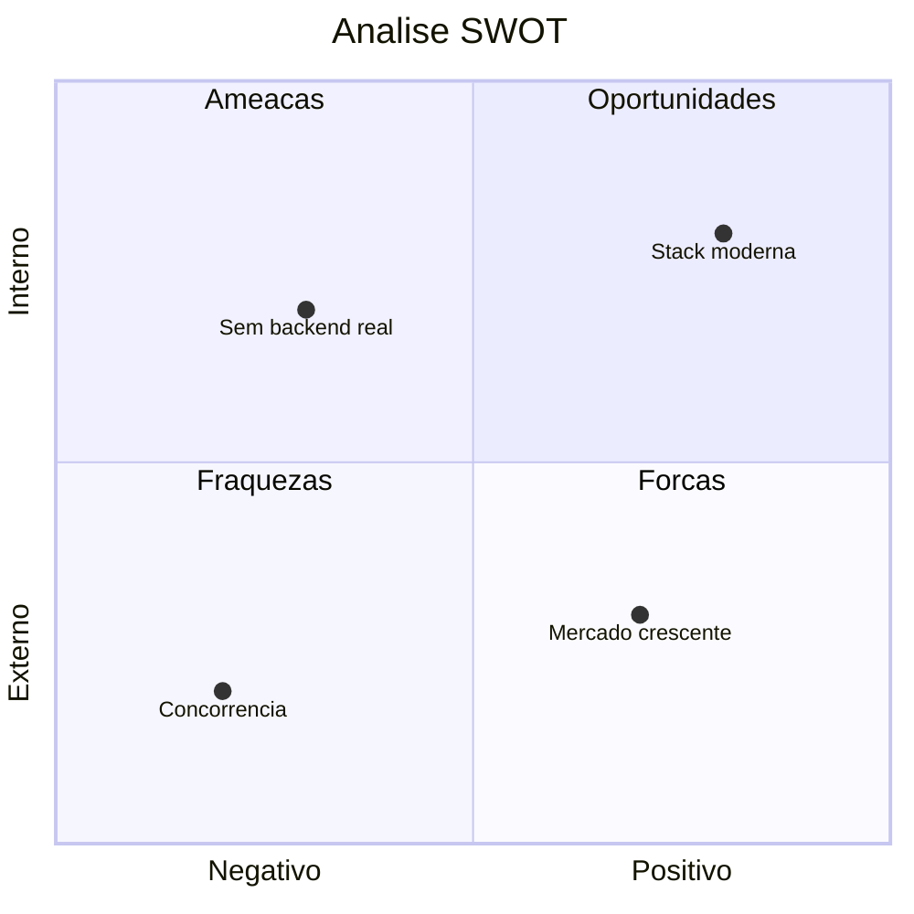

# ANALISE-001: Analise de Viabilidade

## Informacoes Gerais

| Campo | Valor |
|-------|-------|
| **Projeto** | Liquid Flow Monitor (TankControl) |
| **Documento** | Analise de Viabilidade Tecnica e Comercial |
| **Versao** | 1.0 |
| **Data** | Janeiro 2026 |
| **Status** | Aprovado |

## 1. Sumario Executivo

Este documento apresenta a analise de viabilidade do projeto Liquid Flow Monitor, avaliando aspectos tecnicos, economicos e operacionais para determinar a sustentabilidade do projeto.

### Conclusao

| Aspecto | Avaliacao | Status |
|---------|-----------|--------|
| Viabilidade Tecnica | Alta | APROVADO |
| Viabilidade Economica | Alta | APROVADO |
| Viabilidade Operacional | Alta | APROVADO |
| **Decisao Final** | **Projeto Viavel** | **APROVADO** |

## 2. Viabilidade Tecnica

### 2.1 Tecnologias Selecionadas

### 2.2 Avaliacao de Stack

| Tecnologia | Maturidade | Comunidade | Documentacao | Nota |
|------------|------------|------------|--------------|------|
| React | Alta | Muito Grande | Excelente | 10/10 |
| TypeScript | Alta | Grande | Excelente | 10/10 |
| Vite | Alta | Grande | Boa | 9/10 |
| TailwindCSS | Alta | Grande | Excelente | 10/10 |
| shadcn/ui | Media | Crescente | Boa | 8/10 |
| Recharts | Alta | Grande | Boa | 8/10 |

### 2.3 Requisitos de Infraestrutura

| Componente | Requisito Minimo | Recomendado |
|------------|-----------------|-------------|
| Servidor Web | 1 vCPU, 1GB RAM | 2 vCPU, 4GB RAM |
| Banco de Dados | PostgreSQL 14+ | PostgreSQL 16 |
| Storage | 10GB | 50GB |
| Rede | 100 Mbps | 1 Gbps |
| SSL | Obrigatorio | TLS 1.3 |

### 2.4 Compatibilidade

| Navegador | Versao Minima | Suportado |
|-----------|---------------|-----------|
| Chrome | 90+ | Sim |
| Firefox | 88+ | Sim |
| Safari | 14+ | Sim |
| Edge | 90+ | Sim |
| IE | Qualquer | Nao |

### 2.5 Riscos Tecnicos

| Risco | Probabilidade | Impacto | Mitigacao |
|-------|---------------|---------|-----------|
| Incompatibilidade de bibliotecas | Baixa | Medio | Lock de versoes |
| Performance com muitos dados | Media | Alto | Paginacao, lazy loading |
| Seguranca de dados | Baixa | Critico | Criptografia, HTTPS |
| Downtime de hospedagem | Baixa | Alto | Redundancia |

### 2.6 Conclusao Tecnica

**VIAVEL** - A stack selecionada e madura, bem documentada e adequada para o escopo do projeto. Nao ha impedimentos tecnicos identificados.

## 3. Viabilidade Economica

### 3.1 Custos de Desenvolvimento

| Item | Custo Estimado |
|------|----------------|
| Desenvolvimento Frontend | - |
| Desenvolvimento Backend | - |
| UI/UX Design | - |
| Testes e QA | - |
| Documentacao | - |
| **Total Desenvolvimento** | **A definir** |

### 3.2 Custos Operacionais (Mensais)

| Item | Custo/Mes |
|------|-----------|
| Hospedagem Cloud | R$ 200 - R$ 500 |
| Banco de Dados | R$ 100 - R$ 300 |
| Dominio e SSL | R$ 20 |
| Monitoramento | R$ 50 - R$ 100 |
| Backup | R$ 50 |
| **Total Operacional** | **R$ 420 - R$ 970/mes** |

### 3.3 Beneficios Economicos

| Beneficio | Economia Estimada |
|-----------|-------------------|
| Reducao de perdas por divergencia | 2-5% do faturamento |
| Eliminacao de horas extras em inventario | 20 horas/mes |
| Reducao de ruptura de estoque | 1-3% de vendas |
| Otimizacao de precificacao | 1-2% de margem |

### 3.4 ROI Estimado

### 3.5 Conclusao Economica

**VIAVEL** - Os beneficios esperados superam os custos operacionais. O investimento inicial sera recuperado atraves de ganhos de eficiencia e reducao de perdas.

## 4. Viabilidade Operacional

### 4.1 Impacto Organizacional

| Area | Impacto | Nivel |
|------|---------|-------|
| Operacoes | Mudanca de processo manual para digital | Alto |
| Financeiro | Novos relatorios e KPIs | Medio |
| TI | Nova aplicacao para suportar | Baixo |
| Gestao | Novas metricas de controle | Medio |

### 4.2 Capacitacao Necessaria

| Perfil | Horas de Treinamento | Complexidade |
|--------|---------------------|--------------|
| Administrador | 4 horas | Media |
| Operador | 2 horas | Baixa |
| Visualizador | 1 hora | Muito Baixa |

### 4.3 Gestao de Mudanca

### 4.4 Plano de Implantacao

| Fase | Duracao | Atividades |
|------|---------|------------|
| Preparacao | - | Configuracao, dados iniciais |
| Piloto | - | Uso com grupo restrito |
| Expansao | - | Rollout para todos |
| Estabilizacao | - | Suporte intensivo |

### 4.5 Riscos Operacionais

| Risco | Probabilidade | Impacto | Mitigacao |
|-------|---------------|---------|-----------|
| Resistencia dos usuarios | Media | Alto | Treinamento, comunicacao |
| Dados historicos incorretos | Media | Medio | Validacao na migracao |
| Dependencia de internet | Media | Alto | Fallback offline |
| Falta de suporte | Baixa | Alto | Documentacao, SLA |

### 4.6 Conclusao Operacional

**VIAVEL** - A organizacao possui capacidade de absorver a mudanca. O impacto e gerenciavel com plano de capacitacao adequado.

## 5. Analise SWOT

### 5.1 Forcas

- Stack tecnologica moderna e madura
- Interface intuitiva e responsiva
- Calculos financeiros automaticos
- Flexibilidade de filtros e analises
- Codigo bem estruturado

### 5.2 Fraquezas

- Backend ainda mockado
- Sem integracao com sensores
- Dependente de entrada manual
- Sem historico de uso em producao

### 5.3 Oportunidades

- Mercado de gestao de tanques em crescimento
- Integracao futura com IoT
- Expansao para outros tipos de liquidos
- API para integracoes

### 5.4 Ameacas

- Solucoes concorrentes mais maduras
- Resistencia a mudanca dos usuarios
- Custos de infraestrutura variaveis
- Regulamentacoes futuras

## 6. Recomendacoes

### 6.1 Acoes Imediatas

1. **Aprovar o projeto** - Viabilidade confirmada em todas as dimensoes
2. **Definir MVP** - Escopo minimo para primeira entrega
3. **Montar equipe** - Desenvolvimento e suporte
4. **Planejar piloto** - Usuario inicial para validacao

### 6.2 Acoes de Medio Prazo

1. **Desenvolver backend real** - Substituir mocks
2. **Implementar autenticacao** - Seguranca em producao
3. **Criar plano de capacitacao** - Treinamento de usuarios
4. **Estabelecer SLA** - Compromisso de disponibilidade

### 6.3 Acoes de Longo Prazo

1. **Avaliar integracao IoT** - Sensores automaticos
2. **Expandir funcionalidades** - Novos modulos
3. **Analisar integracao ERP** - Sistemas externos
4. **Considerar mobile nativo** - Aplicativo dedicado

## 7. Decisao Final

| Criterio | Peso | Nota | Ponderado |
|----------|------|------|-----------|
| Viabilidade Tecnica | 30% | 9 | 2.7 |
| Viabilidade Economica | 35% | 8 | 2.8 |
| Viabilidade Operacional | 35% | 8 | 2.8 |
| **Total** | **100%** | - | **8.3/10** |

### Parecer Final

**PROJETO APROVADO**

O projeto Liquid Flow Monitor e viavel em todos os aspectos analisados. Recomenda-se prosseguir com o desenvolvimento, priorizando a implementacao do backend real e plano de capacitacao de usuarios.

---

**Documento:** ANALISE-001-viabilidade.md
**Versao:** 1.0
**Ultima Atualizacao:** Janeiro 2026
**Aprovado por:** [Responsavel]
