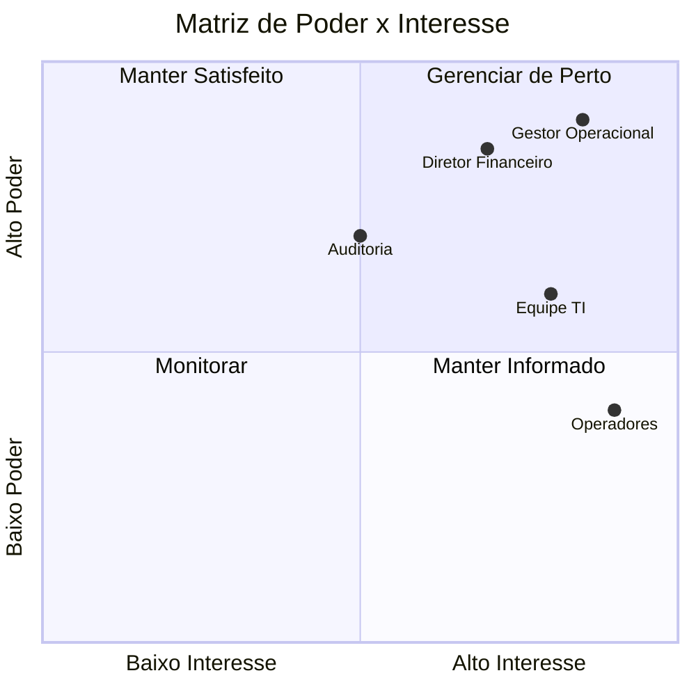
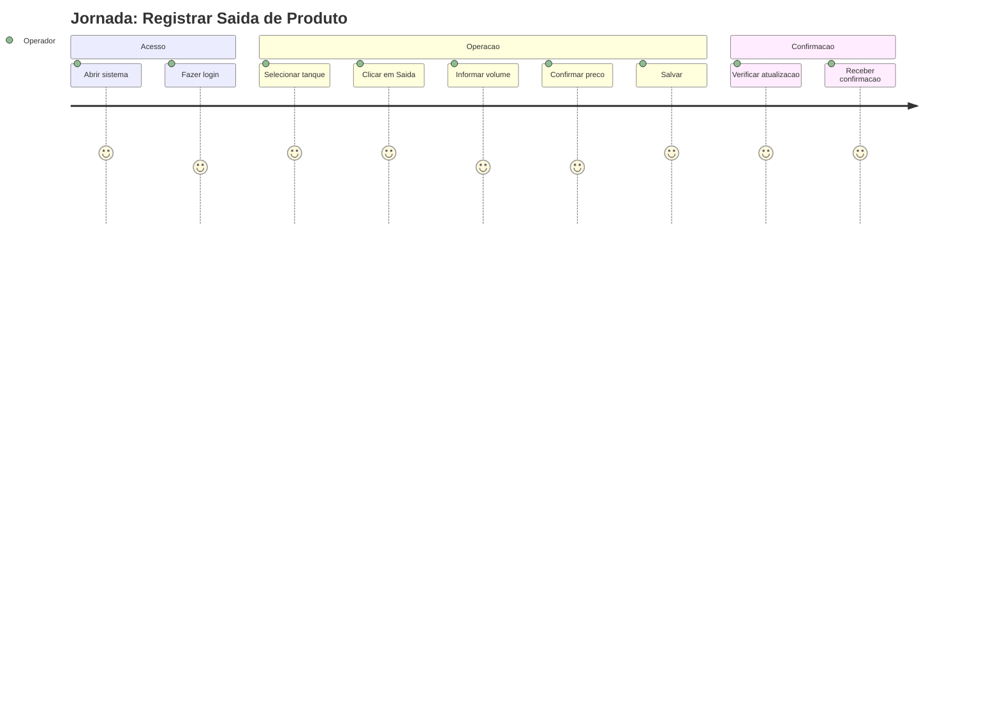
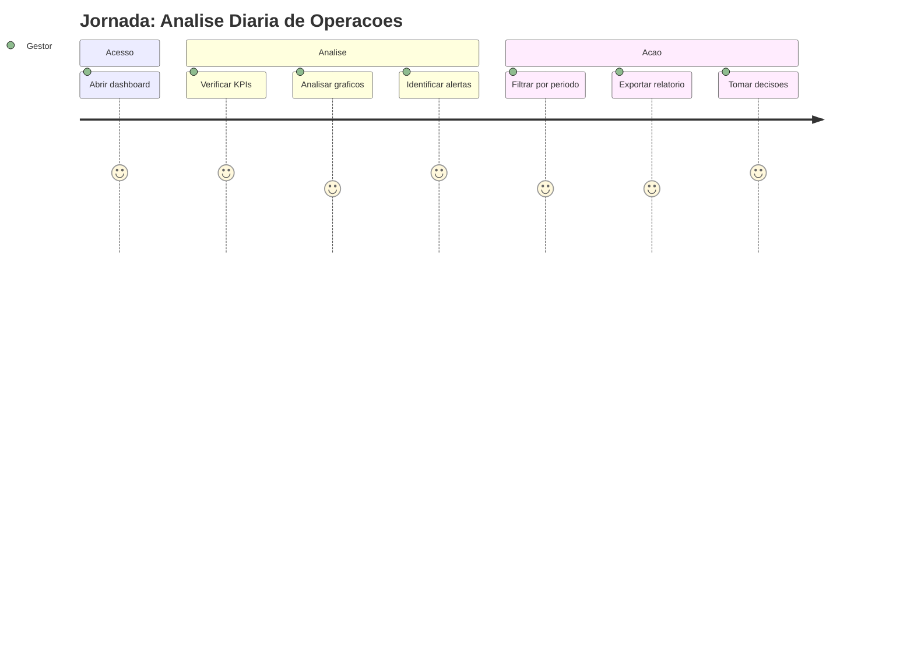
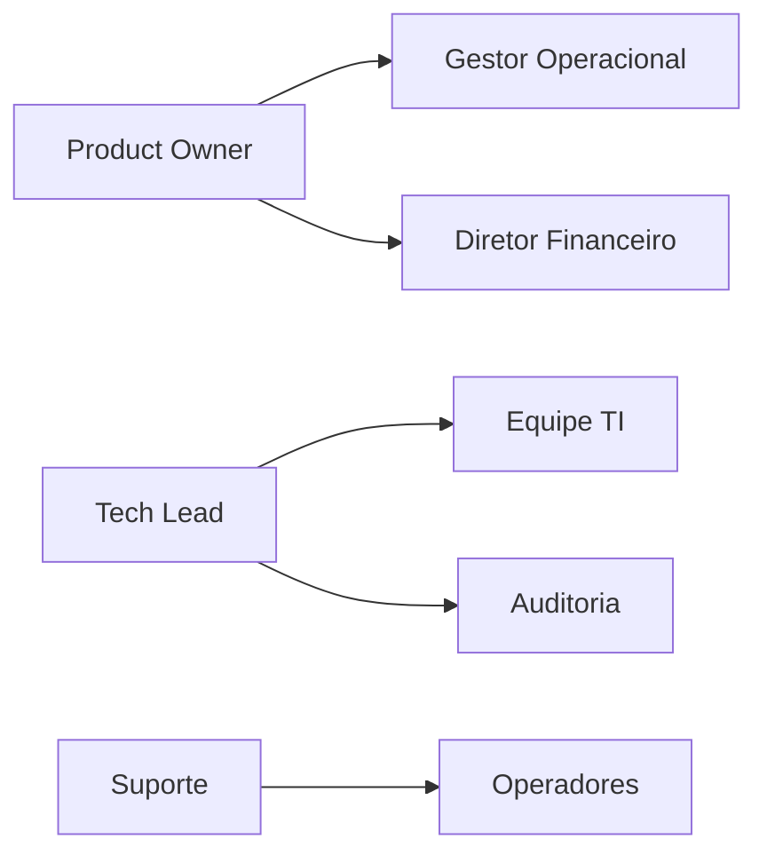

# BRIEFING-002: Identificacao de Stakeholders

## Informacoes Gerais

| Campo | Valor |
|-------|-------|
| **Projeto** | Liquid Flow Monitor (TankControl) |
| **Documento** | Mapeamento de Stakeholders |
| **Versao** | 1.0 |
| **Data** | Janeiro 2026 |

## 1. Visao Geral

Este documento identifica e classifica todos os stakeholders envolvidos no projeto Liquid Flow Monitor, definindo seus interesses, nivel de influencia e estrategia de engajamento.

## 2. Matriz de Stakeholders

### 2.1 Stakeholders Primarios



### 2.2 Detalhamento por Stakeholder

#### Gestor Operacional

| Aspecto | Descricao |
|---------|-----------|
| **Papel** | Responsavel pelas operacoes de tanques |
| **Interesse** | Controle eficiente, reducao de perdas |
| **Influencia** | Alta - decide sobre adocao do sistema |
| **Expectativas** | Dashboard intuitivo, alertas automaticos |
| **Estrategia** | Envolver em todas as decisoes de UX |

#### Operadores de Campo

| Aspecto | Descricao |
|---------|-----------|
| **Papel** | Usuarios diarios do sistema |
| **Interesse** | Facilidade de uso, agilidade |
| **Influencia** | Media - feedback sobre usabilidade |
| **Expectativas** | Interface simples, poucos cliques |
| **Estrategia** | Treinamento pratico, suporte continuo |

#### Diretor Financeiro

| Aspecto | Descricao |
|---------|-----------|
| **Papel** | Analise de rentabilidade e custos |
| **Interesse** | Relatorios financeiros precisos |
| **Influencia** | Alta - aprova investimentos |
| **Expectativas** | KPIs financeiros, exportacao de dados |
| **Estrategia** | Demonstrar ROI e economia |

#### Equipe de TI

| Aspecto | Descricao |
|---------|-----------|
| **Papel** | Suporte tecnico e infraestrutura |
| **Interesse** | Sistema estavel e seguro |
| **Influencia** | Media - define padroes tecnicos |
| **Expectativas** | Documentacao tecnica, baixa manutencao |
| **Estrategia** | Envolver em decisoes de arquitetura |

#### Auditoria

| Aspecto | Descricao |
|---------|-----------|
| **Papel** | Validacao de conformidade |
| **Interesse** | Rastreabilidade e logs |
| **Influencia** | Media - pode bloquear deploy |
| **Expectativas** | Historico completo, trilha de auditoria |
| **Estrategia** | Garantir logging adequado |

## 3. Perfis de Usuario

### 3.1 Administrador (Admin)

```
Perfil: Administrador do Sistema
├── Acesso: Total
├── Funcionalidades:
│   ├── Gerenciar usuarios
│   ├── Configurar parametros
│   ├── Visualizar todos os dados
│   ├── Exportar relatorios
│   └── Reset de dados
└── Quantidade Estimada: 1-2 por empresa
```

**Caracteristicas:**
- Conhecimento tecnico intermediario
- Responsavel pela configuracao inicial
- Gerencia permissoes de outros usuarios
- Acessa relatorios consolidados

### 3.2 Operador

```
Perfil: Operador de Tanques
├── Acesso: Operacional
├── Funcionalidades:
│   ├── Registrar movimentacoes
│   ├── Visualizar tanques
│   ├── Consultar historico proprio
│   └── Receber alertas
└── Quantidade Estimada: 5-20 por empresa
```

**Caracteristicas:**
- Conhecimento tecnico basico
- Uso diario intensivo
- Foco em agilidade
- Mobile-first em campo

### 3.3 Visualizador (Viewer)

```
Perfil: Consulta de Dados
├── Acesso: Somente Leitura
├── Funcionalidades:
│   ├── Visualizar dashboard
│   ├── Consultar historico
│   └── Exportar relatorios basicos
└── Quantidade Estimada: 3-10 por empresa
```

**Caracteristicas:**
- Gerentes e supervisores
- Consulta eventual
- Foco em analise
- Nao registra operacoes

## 4. Jornada do Usuario

### 4.1 Operador - Registro de Saida



### 4.2 Gestor - Analise Diaria



## 5. Necessidades por Stakeholder

| Stakeholder | Necessidade Principal | Funcionalidade Relacionada |
|-------------|----------------------|---------------------------|
| Gestor Operacional | Visao consolidada | Dashboard com KPIs |
| Operadores | Registro rapido | Modal de movimentacao |
| Diretor Financeiro | Analise de lucro | Relatorios financeiros |
| Equipe TI | Estabilidade | Logs e monitoramento |
| Auditoria | Rastreabilidade | Historico completo |

## 6. Comunicacao com Stakeholders

### 6.1 Plano de Comunicacao

| Stakeholder | Frequencia | Canal | Conteudo |
|-------------|------------|-------|----------|
| Gestor Operacional | Semanal | Reuniao | Status e feedback |
| Operadores | Conforme necessario | Sistema | Notificacoes |
| Diretor Financeiro | Mensal | Email | Relatorios KPIs |
| Equipe TI | Continuo | Documentacao | Atualizacoes tecnicas |
| Auditoria | Trimestral | Relatorio | Logs e conformidade |

### 6.2 Pontos de Contato



## 7. Metricas de Satisfacao

| Metrica | Meta | Medicao |
|---------|------|---------|
| NPS Operadores | > 70 | Pesquisa trimestral |
| Tempo de adocao | < 1 semana | Tracking de uso |
| Tickets de suporte | < 5/mes | Help desk |
| Taxa de erro | < 1% | Logs do sistema |

## 8. Riscos por Stakeholder

| Stakeholder | Risco | Probabilidade | Mitigacao |
|-------------|-------|---------------|-----------|
| Operadores | Resistencia a mudanca | Media | Treinamento hands-on |
| Gestor | Expectativas irreais | Baixa | Alinhamento continuo |
| TI | Sobrecarga de suporte | Media | Documentacao completa |
| Auditoria | Nao conformidade | Baixa | Revisao de requisitos |

---

**Documento:** BRIEFING-002-stakeholders.md
**Versao:** 1.0
**Ultima Atualizacao:** Janeiro 2026
