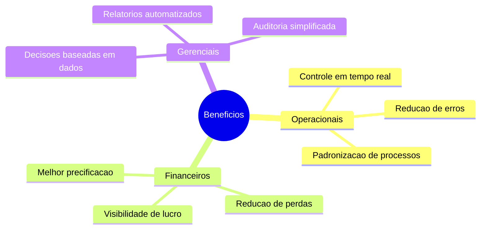

# REQ-001: Requisitos de Negocio

## Informacoes Gerais

| Campo | Valor |
|-------|-------|
| **Projeto** | Liquid Flow Monitor (TankControl) |
| **Documento** | Requisitos de Negocio de Alto Nivel |
| **Versao** | 1.0 |
| **Data** | Janeiro 2026 |
| **Status** | Aprovado |

## 1. Introducao

Este documento descreve os requisitos de negocio de alto nivel para o sistema Liquid Flow Monitor, servindo como base para o detalhamento de casos de uso e especificacoes tecnicas.

## 2. Objetivos de Negocio

### 2.1 Objetivos Estrategicos

| ID | Objetivo | Indicador de Sucesso |
|----|----------|---------------------|
| OBJ-01 | Centralizar gestao de tanques | 100% dos tanques cadastrados |
| OBJ-02 | Eliminar controles manuais | Zero planilhas paralelas |
| OBJ-03 | Aumentar visibilidade financeira | Relatorios diarios disponiveis |
| OBJ-04 | Reduzir perdas por falta de controle | Reducao de 50% em divergencias |
| OBJ-05 | Melhorar tempo de resposta a alertas | Alertas em tempo real |

### 2.2 Beneficios Esperados



## 3. Requisitos de Negocio

### 3.1 Gestao de Tanques

| ID | Requisito | Prioridade | Justificativa |
|----|-----------|------------|---------------|
| RN-01 | Sistema deve permitir cadastro de tanques com capacidade, produto e localizacao | Alta | Base para todas as operacoes |
| RN-02 | Sistema deve exibir volume atual de cada tanque | Alta | Visibilidade operacional |
| RN-03 | Sistema deve indicar visualmente tanques com estoque baixo | Alta | Prevencao de rupturas |
| RN-04 | Sistema deve suportar multiplos sites/unidades | Media | Escalabilidade |
| RN-05 | Sistema deve permitir inativar tanques sem perder historico | Media | Manutencao de dados |

### 3.2 Movimentacoes

| ID | Requisito | Prioridade | Justificativa |
|----|-----------|------------|---------------|
| RN-06 | Sistema deve registrar entradas de produto | Alta | Controle de recebimento |
| RN-07 | Sistema deve registrar saidas com preco de venda | Alta | Controle de vendas |
| RN-08 | Sistema deve permitir ajustes de inventario | Alta | Correcoes e inventarios |
| RN-09 | Sistema deve impedir saida maior que saldo | Alta | Integridade de dados |
| RN-10 | Sistema deve impedir entrada maior que capacidade | Alta | Integridade de dados |
| RN-11 | Sistema deve calcular automaticamente valor e lucro | Alta | Analise financeira |
| RN-12 | Sistema deve registrar operador responsavel | Alta | Rastreabilidade |

### 3.3 Precificacao

| ID | Requisito | Prioridade | Justificativa |
|----|-----------|------------|---------------|
| RN-13 | Sistema deve manter tabela de precos por produto | Alta | Padronizacao de vendas |
| RN-14 | Sistema deve sugerir preco vigente na saida | Media | Agilidade operacional |
| RN-15 | Sistema deve permitir precos futuros agendados | Baixa | Planejamento |

### 3.4 Analise e Relatorios

| ID | Requisito | Prioridade | Justificativa |
|----|-----------|------------|---------------|
| RN-16 | Sistema deve exibir dashboard com KPIs principais | Alta | Visao gerencial |
| RN-17 | Sistema deve permitir filtros por periodo | Alta | Analise temporal |
| RN-18 | Sistema deve permitir filtros por produto/tanque | Alta | Analise segmentada |
| RN-19 | Sistema deve exportar dados em CSV | Alta | Integracao externa |
| RN-20 | Sistema deve exportar relatorios em PDF | Media | Documentacao |

### 3.5 Usuarios e Seguranca

| ID | Requisito | Prioridade | Justificativa |
|----|-----------|------------|---------------|
| RN-21 | Sistema deve exigir autenticacao para acesso | Alta | Seguranca |
| RN-22 | Sistema deve suportar niveis de permissao | Alta | Controle de acesso |
| RN-23 | Sistema deve registrar logs de acoes | Media | Auditoria |

### 3.6 Alertas e Notificacoes

| ID | Requisito | Prioridade | Justificativa |
|----|-----------|------------|---------------|
| RN-24 | Sistema deve alertar quando volume atingir minimo | Alta | Prevencao de ruptura |
| RN-25 | Sistema deve permitir configurar limiar de alerta | Media | Personalizacao |
| RN-26 | Sistema deve enviar notificacoes por email | Baixa | Comunicacao proativa |

## 4. Regras de Negocio

### 4.1 Regras de Movimentacao

```
RG-01: Volume de saida nao pode exceder volume atual do tanque
RG-02: Volume de entrada nao pode exceder capacidade disponivel
RG-03: Toda saida deve ter preco informado
RG-04: Toda movimentacao deve ter operador identificado
RG-05: Data/hora da movimentacao e automatica (timestamp)
```

### 4.2 Regras de Calculo

```
RG-06: Valor Total (saida) = Volume * Preco por Litro
RG-07: Custo Total = Volume * Custo por Litro
RG-08: Lucro = Valor Total - Custo Total
RG-09: Margem (%) = (Lucro / Valor Total) * 100
RG-10: Volume Disponivel = Capacidade - Volume Atual
```

### 4.3 Regras de Status

```
RG-11: Tanque VERMELHO quando Volume < Minimo de Alerta
RG-12: Tanque AMARELO quando Volume < Minimo * 1.5
RG-13: Tanque VERDE quando Volume >= Minimo * 1.5
```

## 5. Requisitos Nao-Funcionais

### 5.1 Performance

| ID | Requisito | Meta |
|----|-----------|------|
| RNF-01 | Tempo de carregamento de pagina | < 3 segundos |
| RNF-02 | Tempo de resposta de operacao | < 1 segundo |
| RNF-03 | Suporte a usuarios simultaneos | > 50 usuarios |

### 5.2 Disponibilidade

| ID | Requisito | Meta |
|----|-----------|------|
| RNF-04 | Uptime do sistema | 99.5% |
| RNF-05 | Tempo maximo de indisponibilidade | 4 horas/mes |
| RNF-06 | Backup de dados | Diario |

### 5.3 Usabilidade

| ID | Requisito | Meta |
|----|-----------|------|
| RNF-07 | Compatibilidade com navegadores | Chrome, Firefox, Edge, Safari |
| RNF-08 | Responsividade | Desktop e Mobile |
| RNF-09 | Tempo de treinamento | < 2 horas |

### 5.4 Seguranca

| ID | Requisito | Meta |
|----|-----------|------|
| RNF-10 | Autenticacao | Obrigatoria |
| RNF-11 | Sessao timeout | 30 minutos inatividade |
| RNF-12 | Senhas | Criptografadas |

## 6. Restricoes

### 6.1 Restricoes Tecnicas

- Sistema deve funcionar em navegadores modernos (ultimas 2 versoes)
- Nao requer instalacao local
- Deve suportar conexoes lentas (3G)

### 6.2 Restricoes de Negocio

- Primeira versao sem integracao com sensores
- Dados inseridos manualmente pelos operadores
- Sem integracao com sistemas externos (ERP, NF-e)

## 7. Criterios de Aceitacao

### 7.1 Criterios Gerais

| Criterio | Definicao de Pronto |
|----------|---------------------|
| Funcionalidade | Atende 100% dos requisitos de alta prioridade |
| Qualidade | Zero bugs criticos em producao |
| Performance | Atende metas de RNF |
| Usabilidade | Aprovado por usuarios piloto |

### 7.2 Checklist de Validacao

- [ ] Todos os tanques podem ser cadastrados e visualizados
- [ ] Movimentacoes sao registradas corretamente
- [ ] Calculos financeiros estao precisos
- [ ] Alertas funcionam conforme regras
- [ ] Relatorios podem ser exportados
- [ ] Sistema e responsivo em mobile
- [ ] Performance atende metas

## 8. Glossario

| Termo | Definicao |
|-------|-----------|
| **Tanque** | Reservatorio para armazenamento de liquido |
| **Movimentacao** | Registro de entrada, saida ou ajuste de volume |
| **Entrada** | Adicao de produto ao tanque (compra, producao) |
| **Saida** | Remocao de produto do tanque (venda, transferencia) |
| **Ajuste** | Correcao de volume por inventario ou divergencia |
| **KPI** | Key Performance Indicator - Indicador de desempenho |
| **Site** | Unidade/filial onde os tanques estao localizados |

## 9. Rastreabilidade

### Matriz de Rastreabilidade Requisitos x Casos de Uso

| Requisito | Caso de Uso Relacionado |
|-----------|------------------------|
| RN-01, RN-02 | UC-001: Visualizar Tanques |
| RN-06, RN-07, RN-08 | UC-002: Registrar Movimentacao |
| RN-09, RN-10 | UC-002: Registrar Movimentacao |
| RN-13, RN-14 | UC-003: Gerenciar Precos |
| RN-16, RN-17, RN-18 | UC-004: Visualizar Dashboard |
| RN-19, RN-20 | UC-005: Exportar Relatorios |
| RN-21, RN-22 | UC-006: Autenticar Usuario |
| RN-24, RN-25 | UC-007: Gerenciar Alertas |

---

**Documento:** REQ-001-requisitos-negocio.md
**Versao:** 1.0
**Ultima Atualizacao:** Janeiro 2026
