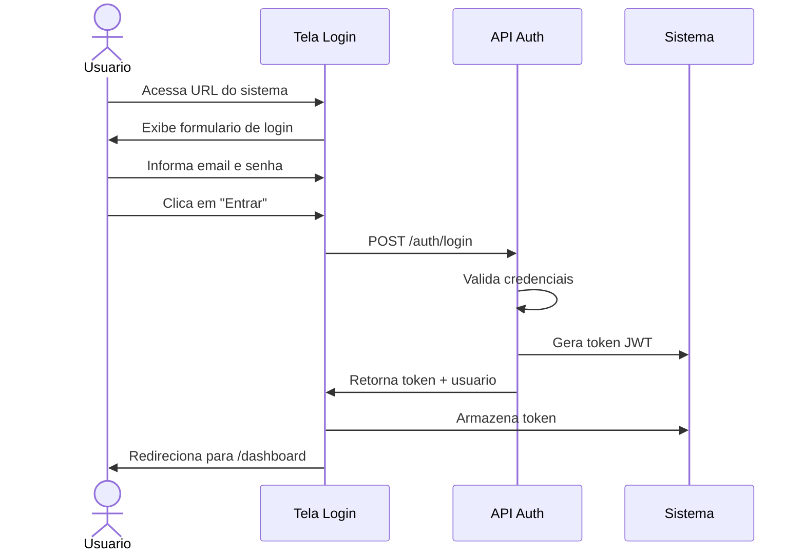
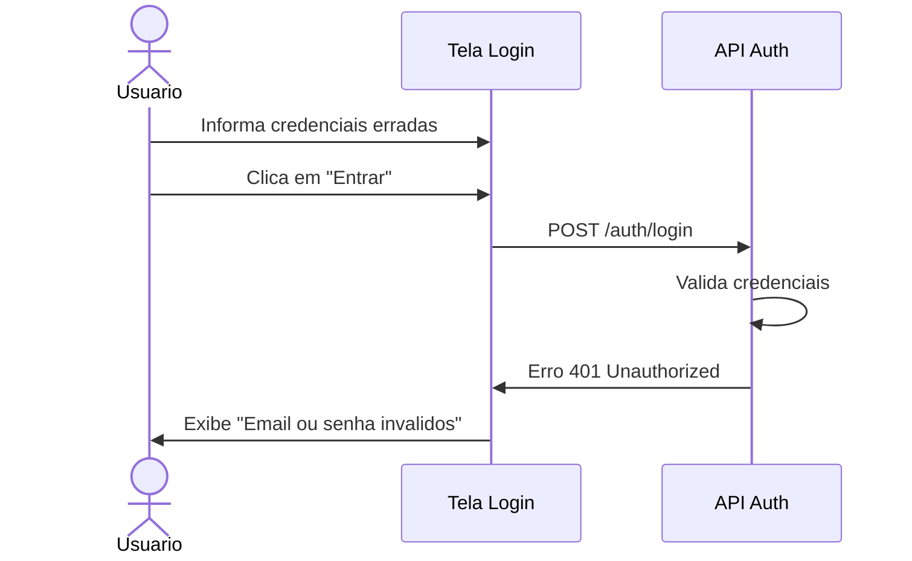

# UC-001: Autenticar Usuario

## 1. Informacoes Gerais

| Campo | Valor |
|-------|-------|
| **ID** | UC-001 |
| **Nome** | Autenticar Usuario |
| **Versao** | 1.0 |
| **Prioridade** | Alta |
| **Complexidade** | Baixa |
| **Status** | Implementado (Mock) |

## 2. Descricao

Este caso de uso descreve o processo de autenticacao de usuarios no sistema Liquid Flow Monitor, permitindo acesso as funcionalidades conforme perfil de permissao.

## 3. Atores

| Ator | Descricao |
|------|-----------|
| **Usuario** | Pessoa que deseja acessar o sistema |
| **Sistema** | Liquid Flow Monitor |

## 4. Pre-condicoes

- Usuario possui cadastro ativo no sistema
- Sistema esta disponivel e operacional
- Usuario possui navegador compativel

## 5. Pos-condicoes

### Sucesso
- Usuario autenticado e redirecionado ao Dashboard
- Sessao criada com token de acesso
- Permissoes carregadas conforme perfil

### Falha
- Mensagem de erro exibida
- Usuario permanece na tela de login
- Tentativa registrada em log

## 6. Fluxo Principal



### Passos Detalhados

| Passo | Ator | Acao |
|-------|------|------|
| 1 | Usuario | Acessa a URL do sistema |
| 2 | Sistema | Exibe tela de login com campos email e senha |
| 3 | Usuario | Preenche email |
| 4 | Usuario | Preenche senha |
| 5 | Usuario | Clica no botao "Entrar" |
| 6 | Sistema | Valida formato dos campos |
| 7 | Sistema | Envia credenciais para API |
| 8 | Sistema | Recebe token de autenticacao |
| 9 | Sistema | Armazena token na sessao |
| 10 | Sistema | Redireciona para Dashboard |

## 7. Fluxos Alternativos

### FA-01: Login com "Lembrar-me"

| Passo | Acao |
|-------|------|
| 5a | Usuario marca opcao "Lembrar-me" |
| 9a | Sistema armazena token em localStorage |
| 10a | Em proximos acessos, usuario e autenticado automaticamente |

### FA-02: Primeiro Acesso

| Passo | Acao |
|-------|------|
| 2a | Usuario clica em "Primeiro acesso" |
| 3a | Sistema exibe formulario de recuperacao |
| 4a | Usuario informa email cadastrado |
| 5a | Sistema envia email com link de criacao de senha |

## 8. Excecoes

### EX-01: Credenciais Invalidas



| Codigo | Condicao | Acao |
|--------|----------|------|
| EX-01 | Email ou senha incorretos | Exibir mensagem de erro generica |
| EX-02 | Usuario inativo | Exibir "Conta desativada. Contate o administrador" |
| EX-03 | Muitas tentativas | Bloquear login por 15 minutos |
| EX-04 | Erro de conexao | Exibir "Erro de conexao. Tente novamente" |
| EX-05 | Sistema indisponivel | Exibir pagina de manutencao |

## 9. Regras de Negocio

| ID | Regra |
|----|-------|
| RN-01 | Email deve ser valido (formato xxx@xxx.xxx) |
| RN-02 | Senha deve ter minimo 6 caracteres |
| RN-03 | Apos 5 tentativas falhas, bloquear por 15 minutos |
| RN-04 | Token JWT expira em 8 horas |
| RN-05 | Sessao inativa expira em 30 minutos |
| RN-06 | Senha nunca e exibida em logs |

## 10. Requisitos Nao-Funcionais

| ID | Requisito | Meta |
|----|-----------|------|
| RNF-01 | Tempo de autenticacao | < 2 segundos |
| RNF-02 | Criptografia de senha | bcrypt ou similar |
| RNF-03 | Transmissao | HTTPS obrigatorio |
| RNF-04 | Token | JWT com assinatura RS256 |

## 11. Casos de Teste

| ID | Cenario | Entrada | Resultado Esperado |
|----|---------|---------|-------------------|
| TC-001-01 | Login valido | Email e senha corretos | Redireciona para Dashboard |
| TC-001-02 | Email invalido | Email inexistente | Mensagem de erro |
| TC-001-03 | Senha incorreta | Senha errada | Mensagem de erro |
| TC-001-04 | Campos vazios | Sem preencher | Validacao de campos |
| TC-001-05 | Usuario inativo | Usuario desativado | Mensagem de conta desativada |
| TC-001-06 | Bloqueio por tentativas | 5 tentativas erradas | Bloqueio temporario |

## 12. Dependencias

### Casos de Uso Relacionados

| UC | Relacao |
|----|---------|
| UC-007 | Gerenciar Usuarios (cadastro) |

### Componentes Tecnicos

| Componente | Arquivo |
|------------|---------|
| Tela de Login | `/src/pages/Login.tsx` |
| API Mock | `/src/services/api.ts` |
| Router | `/src/App.tsx` |

## 13. Prototipo de Tela

```
+------------------------------------------+
|           LIQUID FLOW MONITOR            |
|                TankControl               |
+------------------------------------------+
|                                          |
|   +----------------------------------+   |
|   |           LOGIN                  |   |
|   +----------------------------------+   |
|   |                                  |   |
|   |   Email:                         |   |
|   |   +----------------------------+ |   |
|   |   | usuario@empresa.com        | |   |
|   |   +----------------------------+ |   |
|   |                                  |   |
|   |   Senha:                         |   |
|   |   +----------------------------+ |   |
|   |   | ********                   | |   |
|   |   +----------------------------+ |   |
|   |                                  |   |
|   |   [ ] Lembrar-me                 |   |
|   |                                  |   |
|   |   +----------------------------+ |   |
|   |   |         ENTRAR             | |   |
|   |   +----------------------------+ |   |
|   |                                  |   |
|   |   Esqueceu a senha?              |   |
|   +----------------------------------+   |
|                                          |
+------------------------------------------+
```

## 14. Historico de Alteracoes

| Versao | Data | Autor | Alteracao |
|--------|------|-------|-----------|
| 1.0 | Janeiro 2026 | Equipe | Criacao inicial |

---

**Documento:** UC-001-autenticar-usuario.md
**Ultima Atualizacao:** Janeiro 2026
