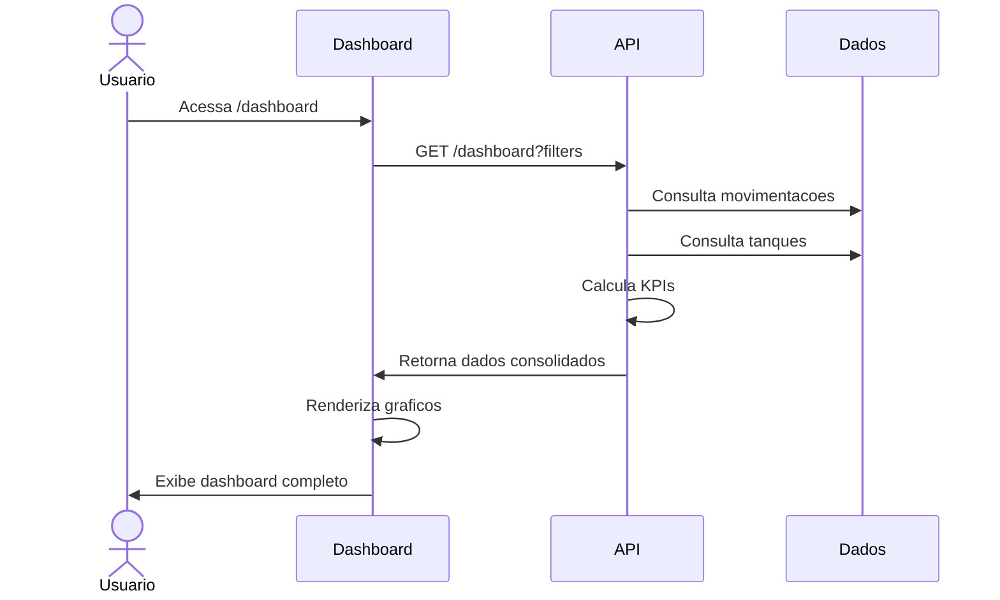

# UC-002: Visualizar Dashboard

## 1. Informacoes Gerais

| Campo | Valor |
|-------|-------|
| **ID** | UC-002 |
| **Nome** | Visualizar Dashboard |
| **Versao** | 1.0 |
| **Prioridade** | Alta |
| **Complexidade** | Media |
| **Status** | Implementado |

## 2. Descricao

Este caso de uso descreve a visualizacao do dashboard principal do sistema, onde o usuario pode acompanhar KPIs, graficos de desempenho e status geral dos tanques.

## 3. Atores

| Ator | Descricao |
|------|-----------|
| **Usuario Autenticado** | Admin, Operador ou Visualizador |
| **Sistema** | Liquid Flow Monitor |

## 4. Pre-condicoes

- Usuario autenticado no sistema
- Dados de movimentacoes existentes (para graficos)
- Tanques cadastrados

## 5. Pos-condicoes

### Sucesso
- Dashboard exibido com dados atualizados
- KPIs calculados corretamente
- Graficos renderizados

### Falha
- Mensagem de erro ou dados vazios
- Indicadores zerados

## 6. Fluxo Principal



### Passos Detalhados

| Passo | Ator | Acao |
|-------|------|------|
| 1 | Usuario | Acessa o Dashboard (menu ou URL) |
| 2 | Sistema | Aplica filtros padrao (ultimo mes) |
| 3 | Sistema | Busca dados de movimentacoes |
| 4 | Sistema | Busca dados de tanques |
| 5 | Sistema | Calcula KPIs (faturamento, lucro, volume, margem) |
| 6 | Sistema | Gera dados para graficos |
| 7 | Sistema | Renderiza componentes visuais |
| 8 | Usuario | Visualiza informacoes consolidadas |

## 7. Fluxos Alternativos

### FA-01: Aplicar Filtros

| Passo | Acao |
|-------|------|
| 8a | Usuario clica em filtros na Topbar |
| 8b | Usuario seleciona periodo, produto, tanque, site |
| 8c | Sistema recarrega dados com novos filtros |
| 8d | Dashboard atualiza em tempo real |

### FA-02: Visualizar Periodo Customizado

| Passo | Acao |
|-------|------|
| 8a | Usuario seleciona "Personalizado" no filtro de periodo |
| 8b | Sistema exibe date pickers (inicio e fim) |
| 8c | Usuario define datas |
| 8d | Sistema recarrega com periodo customizado |

### FA-03: Acao Rapida em Tanque

| Passo | Acao |
|-------|------|
| 8a | Usuario visualiza card de tanque no Dashboard |
| 8b | Usuario clica em botao de acao (Entrada/Saida) |
| 8c | Sistema abre modal de movimentacao (UC-004) |

## 8. Excecoes

| Codigo | Condicao | Acao |
|--------|----------|------|
| EX-01 | Sem dados no periodo | Exibir "Nenhuma movimentacao encontrada" |
| EX-02 | Erro de conexao | Exibir toast de erro e retry |
| EX-03 | Timeout na API | Exibir skeleton e tentar novamente |
| EX-04 | Sem tanques cadastrados | Exibir orientacao para cadastrar |

## 9. Regras de Negocio

| ID | Regra |
|----|-------|
| RN-01 | Filtro padrao: ultimo mes |
| RN-02 | KPIs calculados apenas com movimentacoes de SAIDA |
| RN-03 | Faturamento = SUM(volume * preco) |
| RN-04 | COGS = SUM(volume * custo) |
| RN-05 | Lucro = Faturamento - COGS |
| RN-06 | Margem = (Lucro / Faturamento) * 100 |
| RN-07 | Ticket Medio = Faturamento / Quantidade de Saidas |
| RN-08 | Crescimento = ((Atual - Anterior) / Anterior) * 100 |

## 10. Requisitos Nao-Funcionais

| ID | Requisito | Meta |
|----|-----------|------|
| RNF-01 | Tempo de carregamento | < 3 segundos |
| RNF-02 | Atualizacao de graficos | < 1 segundo |
| RNF-03 | Responsividade | Desktop e Mobile |
| RNF-04 | Cache | 5 minutos para consultas repetidas |

## 11. Casos de Teste

| ID | Cenario | Entrada | Resultado Esperado |
|----|---------|---------|-------------------|
| TC-002-01 | Dashboard com dados | Movimentacoes existentes | KPIs e graficos exibidos |
| TC-002-02 | Dashboard vazio | Sem movimentacoes | Mensagem apropriada |
| TC-002-03 | Filtro por periodo | Selecionar "Hoje" | Dados filtrados |
| TC-002-04 | Filtro por produto | Selecionar "Alcool" | Apenas dados de alcool |
| TC-002-05 | Calculo de KPIs | Verificar formulas | Valores corretos |
| TC-002-06 | Responsividade | Acesso mobile | Layout adaptado |

## 12. Dependencias

### Casos de Uso Relacionados

| UC | Relacao |
|----|---------|
| UC-001 | Autenticar Usuario (pre-requisito) |
| UC-004 | Registrar Movimentacao (acao rapida) |
| UC-003 | Visualizar Tanques (link) |

### Componentes Tecnicos

| Componente | Arquivo |
|------------|---------|
| Pagina Dashboard | `/src/pages/Dashboard.tsx` |
| KPI Card | `/src/components/KPICard.tsx` |
| Tank Card | `/src/components/TankCard.tsx` |
| API Service | `/src/services/api.ts` |
| Filter Context | `/src/contexts/FilterContext.tsx` |

## 13. Elementos do Dashboard

### 13.1 KPIs Exibidos

| KPI | Icone | Descricao |
|-----|-------|-----------|
| Faturamento | DollarSign | Total de vendas no periodo |
| Volume | Droplets | Litros vendidos |
| COGS | Package | Custo dos produtos vendidos |
| Lucro | TrendingUp | Faturamento - COGS |
| Margem | Percent | Percentual de lucro |
| Ticket Medio | Receipt | Faturamento / Vendas |

### 13.2 Graficos

| Grafico | Tipo | Dados |
|---------|------|-------|
| Vendas por Produto | Pie Chart | Volume por produto |
| Faturamento Temporal | Line Chart | Evolucao por dia/mes |
| Lucro vs Margem | Bar + Line | Comparativo por produto |
| Top 5 Tanques | Bar Chart | Maiores faturamentos |
| Heatmap | Grid | Vendas por dia/hora |

### 13.3 Cards de Tanques

| Elemento | Descricao |
|----------|-----------|
| Nome | Identificacao do tanque |
| Produto | Tipo de liquido |
| Barra de Volume | Percentual de capacidade |
| Status | Verde/Amarelo/Vermelho |
| Acoes | Botoes Entrada/Saida |

## 14. Prototipo de Tela

```
+------------------------------------------------------------------+
| [Logo] TankControl          [Filtros] [Tema] [Usuario]           |
+------------------------------------------------------------------+
| [Sidebar]  |                                                      |
| Dashboard  |  +-------------+ +-------------+ +-------------+     |
| Tanques    |  | Faturamento | |   Volume    | |    COGS     |     |
| Moviment.  |  | R$ 125.430  | |  45.230 L   | | R$ 89.200   |     |
| Precos     |  | +12.5%      | |  +8.3%      | |  +5.2%      |     |
| Relatorios |  +-------------+ +-------------+ +-------------+     |
| Admin      |                                                      |
| Config     |  +-------------+ +-------------+ +-------------+     |
|            |  |    Lucro    | |   Margem    | |Ticket Medio |     |
|            |  | R$ 36.230   | |   28.9%     | | R$ 1.250    |     |
|            |  | +18.2%      | |  +2.1pp     | |  +3.4%      |     |
|            |  +-------------+ +-------------+ +-------------+     |
|            |                                                      |
|            |  +------------------+ +------------------+           |
|            |  | Vendas/Produto   | | Faturamento      |           |
|            |  |    [PIE CHART]   | |   [LINE CHART]   |           |
|            |  +------------------+ +------------------+           |
|            |                                                      |
|            |  +------------------+ +------------------+           |
|            |  | Top 5 Tanques    | |   Heatmap        |           |
|            |  |   [BAR CHART]    | |   [GRID]         |           |
|            |  +------------------+ +------------------+           |
|            |                                                      |
|            |  Tanques:                                            |
|            |  +--------+ +--------+ +--------+ +--------+         |
|            |  |Tank 01 | |Tank 02 | |Tank 03 | |Tank 04 |         |
|            |  |[=====] | |[===  ] | |[==   ] | |[======]|         |
|            |  | 85%    | | 45%    | | 22%    | | 95%    |         |
|            |  +--------+ +--------+ +--------+ +--------+         |
+------------------------------------------------------------------+
```

## 15. Historico de Alteracoes

| Versao | Data | Autor | Alteracao |
|--------|------|-------|-----------|
| 1.0 | Janeiro 2026 | Equipe | Criacao inicial |

---

**Documento:** UC-002-visualizar-dashboard.md
**Ultima Atualizacao:** Janeiro 2026
