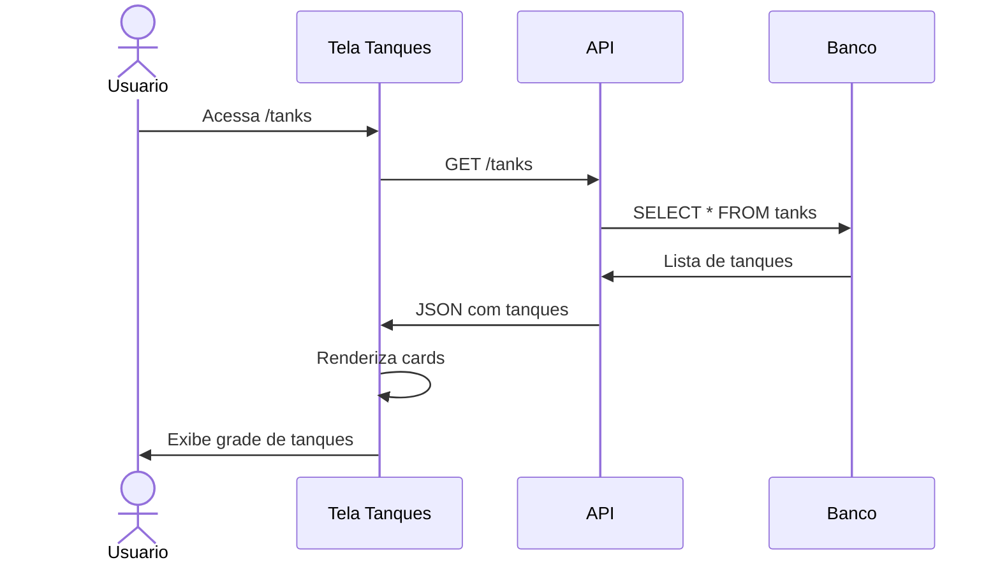

# UC-003: Gerenciar Tanques

## 1. Informacoes Gerais

| Campo | Valor |
|-------|-------|
| **ID** | UC-003 |
| **Nome** | Gerenciar Tanques |
| **Versao** | 1.0 |
| **Prioridade** | Alta |
| **Complexidade** | Media |
| **Status** | Implementado |

## 2. Descricao

Este caso de uso descreve as operacoes de visualizacao e gerenciamento de tanques, incluindo listagem, visualizacao de status, capacidade, volume atual e acoes rapidas de movimentacao.

## 3. Atores

| Ator | Descricao |
|------|-----------|
| **Administrador** | Pode cadastrar, editar e inativar tanques |
| **Operador** | Pode visualizar e executar movimentacoes |
| **Visualizador** | Apenas visualizacao |

## 4. Pre-condicoes

- Usuario autenticado no sistema
- Permissao adequada ao perfil

## 5. Pos-condicoes

### Sucesso
- Lista de tanques exibida com dados atuais
- Acoes executadas refletidas no sistema

### Falha
- Mensagem de erro apropriada
- Dados nao alterados

## 6. Fluxo Principal



### Passos Detalhados

| Passo | Ator | Acao |
|-------|------|------|
| 1 | Usuario | Acessa menu "Tanques" |
| 2 | Sistema | Busca lista de tanques da API |
| 3 | Sistema | Calcula percentuais e status |
| 4 | Sistema | Renderiza cards de tanques |
| 5 | Usuario | Visualiza informacoes dos tanques |

## 7. Fluxos Alternativos

### FA-01: Visualizar Detalhes do Tanque

| Passo | Acao |
|-------|------|
| 5a | Usuario clica no card do tanque |
| 5b | Sistema exibe modal com detalhes |
| 5c | Usuario visualiza historico e dados completos |

### FA-02: Executar Acao Rapida

| Passo | Acao |
|-------|------|
| 5a | Usuario clica em "Entrada" ou "Saida" no card |
| 5b | Sistema abre modal de movimentacao (UC-004) |
| 5c | Usuario registra movimentacao |
| 5d | Sistema atualiza volume do tanque |

### FA-03: Filtrar Tanques

| Passo | Acao |
|-------|------|
| 5a | Usuario seleciona filtro (produto, site, status) |
| 5b | Sistema filtra lista de tanques |
| 5c | Apenas tanques correspondentes sao exibidos |

### FA-04: Cadastrar Novo Tanque (Admin)

| Passo | Acao |
|-------|------|
| 5a | Admin clica em "Novo Tanque" |
| 5b | Sistema exibe formulario de cadastro |
| 5c | Admin preenche: nome, produto, capacidade, site, minimo alerta |
| 5d | Admin clica em "Salvar" |
| 5e | Sistema valida e cria tanque |
| 5f | Novo tanque aparece na lista |

### FA-05: Editar Tanque (Admin)

| Passo | Acao |
|-------|------|
| 5a | Admin clica em "Editar" no card |
| 5b | Sistema exibe formulario com dados atuais |
| 5c | Admin altera campos desejados |
| 5d | Admin clica em "Salvar" |
| 5e | Sistema valida e atualiza tanque |

### FA-06: Inativar Tanque (Admin)

| Passo | Acao |
|-------|------|
| 5a | Admin clica em "Inativar" no card |
| 5b | Sistema exibe confirmacao |
| 5c | Admin confirma inativacao |
| 5d | Sistema altera status para "inativo" |
| 5e | Tanque permanece na lista (historico preservado) |

## 8. Excecoes

| Codigo | Condicao | Acao |
|--------|----------|------|
| EX-01 | Sem tanques cadastrados | Exibir mensagem e botao de cadastro |
| EX-02 | Erro de conexao | Toast de erro com retry |
| EX-03 | Sem permissao para acao | Mensagem de acesso negado |
| EX-04 | Tanque em uso (inativacao) | Alertar sobre movimentacoes pendentes |

## 9. Regras de Negocio

| ID | Regra |
|----|-------|
| RN-01 | Tanque VERDE: volume >= minimo * 1.5 |
| RN-02 | Tanque AMARELO: minimo <= volume < minimo * 1.5 |
| RN-03 | Tanque VERMELHO: volume < minimo |
| RN-04 | Volume disponivel = capacidade - volume_atual |
| RN-05 | Percentual = (volume_atual / capacidade) * 100 |
| RN-06 | Valor estimado = volume_atual * preco_vigente |
| RN-07 | Tanque inativo nao pode receber movimentacoes |
| RN-08 | Tanque em manutencao bloqueia operacoes |

## 10. Requisitos Nao-Funcionais

| ID | Requisito | Meta |
|----|-----------|------|
| RNF-01 | Tempo de listagem | < 2 segundos |
| RNF-02 | Atualizacao apos movimentacao | Imediata |
| RNF-03 | Suporte a quantidade | 100+ tanques |
| RNF-04 | Responsividade | Cards adaptaveis |

## 11. Casos de Teste

| ID | Cenario | Entrada | Resultado Esperado |
|----|---------|---------|-------------------|
| TC-003-01 | Listar tanques | Acesso a pagina | Lista completa exibida |
| TC-003-02 | Status verde | Volume alto | Card com borda verde |
| TC-003-03 | Status amarelo | Volume medio | Card com borda amarela |
| TC-003-04 | Status vermelho | Volume baixo | Card com borda vermelha |
| TC-003-05 | Acao entrada | Clicar entrada | Modal de movimentacao |
| TC-003-06 | Cadastrar tanque | Admin cria | Tanque aparece na lista |
| TC-003-07 | Inativar tanque | Admin inativa | Status alterado |
| TC-003-08 | Filtrar por produto | Selecionar Alcool | Apenas tanques de alcool |

## 12. Dependencias

### Casos de Uso Relacionados

| UC | Relacao |
|----|---------|
| UC-001 | Autenticar Usuario (pre-requisito) |
| UC-004 | Registrar Movimentacao (acao) |

### Componentes Tecnicos

| Componente | Arquivo |
|------------|---------|
| Pagina Tanques | `/src/pages/Tanks.tsx` |
| Card de Tanque | `/src/components/TankCard.tsx` |
| API Service | `/src/services/api.ts` |
| Types | `/src/types/index.ts` |

## 13. Modelo de Dados

### Entidade Tank

```typescript
interface Tank {
  id: string;              // UUID
  name: string;            // Nome identificador
  product: "Alcool" | "Cachaca" | "Ambos";
  capacity_l: number;      // Capacidade em litros
  current_volume_l: number; // Volume atual
  min_alert_l: number;     // Limiar de alerta
  site_id: string;         // Referencia ao site
  status: "active" | "inactive" | "maintenance";
  created_at: string;      // ISO timestamp
  updated_at: string;      // ISO timestamp
}
```

## 14. Prototipo de Tela

```
+------------------------------------------------------------------+
| [Logo] TankControl                              [Usuario] [Tema]  |
+------------------------------------------------------------------+
| [Sidebar]  |  TANQUES                           [+ Novo Tanque]  |
|            |                                                      |
| Dashboard  |  Filtros: [Todos Produtos v] [Todos Sites v]        |
| > Tanques  |                                                      |
| Moviment.  |  +------------------+  +------------------+          |
| Precos     |  | TANQUE 01        |  | TANQUE 02        |          |
| Relatorios |  | Alcool           |  | Cachaca          |          |
| Admin      |  | Site: Sao Paulo  |  | Site: Curitiba   |          |
| Config     |  |                  |  |                  |          |
|            |  | [==============] |  | [========      ] |          |
|            |  | 85% (17.000 L)   |  | 55% (11.000 L)   |          |
|            |  | Cap: 20.000 L    |  | Cap: 20.000 L    |          |
|            |  |                  |  |                  |          |
|            |  | Valor: R$ 51.000 |  | Valor: R$ 44.000 |          |
|            |  |                  |  |                  |          |
|            |  | [Entrada] [Saida]|  | [Entrada] [Saida]|          |
|            |  +------------------+  +------------------+          |
|            |                                                      |
|            |  +------------------+  +------------------+          |
|            |  | TANQUE 03        |  | TANQUE 04        |          |
|            |  | Cachaca          |  | Alcool           |          |
|            |  | Site: B.Horizonte|  | Site: Sao Paulo  |          |
|            |  |                  |  |                  |          |
|            |  | [====          ] |  | [=             ] |          |
|            |  | 22% (4.400 L)    |  | 8% (1.600 L)     |          |
|            |  | ALERTA!          |  | CRITICO!         |          |
|            |  |                  |  |                  |          |
|            |  | [Entrada] [Saida]|  | [Entrada] [Saida]|          |
|            |  +------------------+  +------------------+          |
+------------------------------------------------------------------+
```

## 15. Informacoes do Card

| Elemento | Descricao | Exemplo |
|----------|-----------|---------|
| Nome | Identificacao unica | "TANQUE 01" |
| Produto | Tipo de liquido | "Alcool" |
| Site | Localizacao | "Site: Sao Paulo" |
| Barra | Representacao visual | [==============] |
| Percentual | % da capacidade | "85%" |
| Volume | Litros atuais | "(17.000 L)" |
| Capacidade | Total suportado | "Cap: 20.000 L" |
| Valor | Estimativa financeira | "Valor: R$ 51.000" |
| Status | Alerta visual | Borda colorida |
| Acoes | Botoes rapidos | [Entrada] [Saida] |

## 16. Historico de Alteracoes

| Versao | Data | Autor | Alteracao |
|--------|------|-------|-----------|
| 1.0 | Janeiro 2026 | Equipe | Criacao inicial |

---

**Documento:** UC-003-gerenciar-tanques.md
**Ultima Atualizacao:** Janeiro 2026
