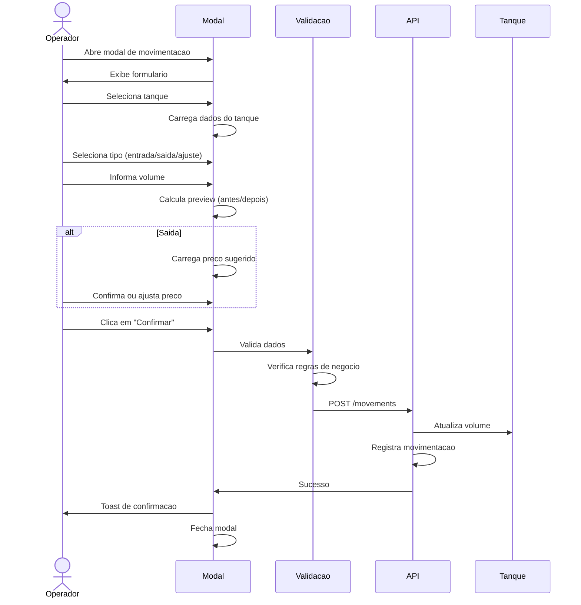
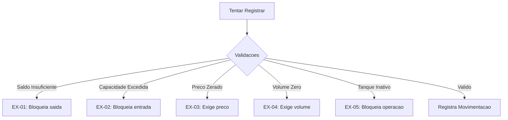

# UC-004: Registrar Movimentacao

## 1. Informacoes Gerais

| Campo | Valor |
|-------|-------|
| **ID** | UC-004 |
| **Nome** | Registrar Movimentacao |
| **Versao** | 1.0 |
| **Prioridade** | Alta |
| **Complexidade** | Alta |
| **Status** | Implementado |

## 2. Descricao

Este caso de uso descreve o registro de movimentacoes de liquidos nos tanques, incluindo operacoes de entrada (recebimento), saida (venda) e ajuste (correcao de inventario), com calculo automatico de valores financeiros.

## 3. Atores

| Ator | Descricao |
|------|-----------|
| **Operador** | Registra movimentacoes do dia-a-dia |
| **Administrador** | Registra movimentacoes e correcoes |

## 4. Pre-condicoes

- Usuario autenticado com perfil Operador ou Admin
- Pelo menos um tanque ativo cadastrado
- Tabela de precos configurada (para saidas)

## 5. Pos-condicoes

### Sucesso
- Movimentacao registrada no historico
- Volume do tanque atualizado
- Valores financeiros calculados (se saida)
- Operador registrado como responsavel

### Falha
- Movimentacao nao registrada
- Volume do tanque inalterado
- Mensagem de erro exibida

## 6. Fluxo Principal



### Passos Detalhados

| Passo | Ator | Acao |
|-------|------|------|
| 1 | Operador | Clica em "Nova Movimentacao" ou acao rapida |
| 2 | Sistema | Exibe modal com formulario |
| 3 | Operador | Seleciona tanque na lista |
| 4 | Sistema | Carrega volume atual e produto do tanque |
| 5 | Operador | Seleciona tipo de movimentacao |
| 6 | Sistema | Ajusta campos conforme tipo |
| 7 | Operador | Informa volume em litros |
| 8 | Sistema | Exibe preview de volume antes/depois |
| 9 | Operador | Informa preco (se saida) |
| 10 | Sistema | Calcula valor total e lucro |
| 11 | Operador | Opcionalmente adiciona referencia/notas |
| 12 | Operador | Clica em "Confirmar" |
| 13 | Sistema | Valida todos os campos |
| 14 | Sistema | Registra movimentacao |
| 15 | Sistema | Atualiza volume do tanque |
| 16 | Sistema | Exibe confirmacao |

## 7. Fluxos Alternativos

### FA-01: Movimentacao de Entrada

| Passo | Acao |
|-------|------|
| 5a | Operador seleciona "Entrada" |
| 6a | Sistema oculta campo de preco de venda |
| 6b | Sistema habilita campo de custo (opcional) |
| 8a | Preview mostra adicao ao volume |

### FA-02: Movimentacao de Saida

| Passo | Acao |
|-------|------|
| 5a | Operador seleciona "Saida" |
| 6a | Sistema exibe campo de preco de venda |
| 6b | Sistema sugere preco vigente da tabela |
| 10a | Sistema calcula: Valor = Volume * Preco |
| 10b | Sistema calcula: Lucro = Valor - Custo |

### FA-03: Movimentacao de Ajuste

| Passo | Acao |
|-------|------|
| 5a | Operador seleciona "Ajuste" |
| 6a | Sistema oculta campos financeiros |
| 7a | Volume pode ser positivo ou negativo |
| 8a | Preview mostra novo volume resultante |

### FA-04: Acao Rapida via Card

| Passo | Acao |
|-------|------|
| 1a | Operador clica em "Entrada" ou "Saida" no card do tanque |
| 2a | Modal abre com tanque pre-selecionado |
| 5a | Tipo pre-selecionado conforme botao clicado |

## 8. Excecoes



| Codigo | Condicao | Mensagem |
|--------|----------|----------|
| EX-01 | Saida > Volume atual | "Saldo insuficiente. Disponivel: X litros" |
| EX-02 | Entrada > Capacidade disponivel | "Capacidade excedida. Disponivel: X litros" |
| EX-03 | Saida sem preco | "Informe o preco de venda" |
| EX-04 | Volume zero ou negativo (exceto ajuste) | "Volume deve ser maior que zero" |
| EX-05 | Tanque inativo ou manutencao | "Tanque indisponivel para operacao" |
| EX-06 | Erro de conexao | "Erro ao registrar. Tente novamente" |

## 9. Regras de Negocio

| ID | Regra |
|----|-------|
| RN-01 | Volume de saida nao pode exceder volume atual |
| RN-02 | Volume de entrada nao pode exceder capacidade disponivel |
| RN-03 | Saida obriga informar preco de venda |
| RN-04 | Valor Total = Volume * Preco por Litro |
| RN-05 | Custo Total = Volume * Custo por Litro |
| RN-06 | Lucro = Valor Total - Custo Total |
| RN-07 | Operador e registrado automaticamente |
| RN-08 | Data/hora e timestamp do servidor |
| RN-09 | Ajuste pode ter volume positivo ou negativo |
| RN-10 | Preco sugerido vem da tabela de precos vigente |

## 10. Requisitos Nao-Funcionais

| ID | Requisito | Meta |
|----|-----------|------|
| RNF-01 | Tempo de registro | < 1 segundo |
| RNF-02 | Validacao em tempo real | Instantanea |
| RNF-03 | Atomicidade | Movimento + Atualizacao tanque |
| RNF-04 | Auditoria | Log de todas operacoes |

## 11. Casos de Teste

| ID | Cenario | Entrada | Resultado Esperado |
|----|---------|---------|-------------------|
| TC-004-01 | Entrada valida | 1000L em tanque com espaco | Sucesso, volume aumenta |
| TC-004-02 | Saida valida | 500L com preco | Sucesso, volume diminui |
| TC-004-03 | Saida sem saldo | 5000L (saldo 1000L) | Erro EX-01 |
| TC-004-04 | Entrada excede capacidade | 10000L (capacidade 5000L) | Erro EX-02 |
| TC-004-05 | Saida sem preco | Volume sem preco | Erro EX-03 |
| TC-004-06 | Ajuste positivo | +500L | Volume aumenta |
| TC-004-07 | Ajuste negativo | -200L | Volume diminui |
| TC-004-08 | Calculo de lucro | Saida com preco e custo | Lucro calculado |
| TC-004-09 | Preco sugerido | Abrir modal de saida | Preco vigente carregado |

## 12. Dependencias

### Casos de Uso Relacionados

| UC | Relacao |
|----|---------|
| UC-001 | Autenticar Usuario (pre-requisito) |
| UC-003 | Gerenciar Tanques (selecao) |
| UC-006 | Gerenciar Precos (preco sugerido) |
| UC-005 | Consultar Movimentacoes (resultado) |

### Componentes Tecnicos

| Componente | Arquivo |
|------------|---------|
| Modal de Movimentacao | `/src/components/MovementModal.tsx` |
| API Service | `/src/services/api.ts` |
| Types | `/src/types/index.ts` |

## 13. Modelo de Dados

### Entidade Movement

```typescript
interface Movement {
  id: string;              // UUID gerado
  tank_id: string;         // Referencia ao tanque
  product: "Alcool" | "Cachaca";
  type: "entrada" | "saida" | "ajuste";
  volume_l: number;        // Litros movimentados
  price_per_l?: number;    // Preco de venda (saida)
  cost_per_l?: number;     // Custo unitario
  total_value: number;     // Valor total (saida)
  total_cost?: number;     // Custo total
  profit?: number;         // Lucro (saida)
  reference?: string;      // NF, ordem, etc.
  notes?: string;          // Observacoes
  operator_id: string;     // Usuario responsavel
  created_at: string;      // ISO timestamp
}
```

## 14. Prototipo de Tela

```
+------------------------------------------+
|           NOVA MOVIMENTACAO              |
+------------------------------------------+
|                                          |
|  Tanque: *                               |
|  +------------------------------------+  |
|  | Selecione o tanque           [v]  |  |
|  +------------------------------------+  |
|                                          |
|  Volume Atual: 15.000 L                  |
|  Capacidade: 20.000 L                    |
|  Disponivel: 5.000 L                     |
|                                          |
|  Tipo de Movimentacao: *                 |
|  ( ) Entrada  (x) Saida  ( ) Ajuste      |
|                                          |
|  Volume (L): *                           |
|  +------------------------------------+  |
|  | 1000                               |  |
|  +------------------------------------+  |
|                                          |
|  +------------------------------------+  |
|  | Antes:  15.000 L                   |  |
|  | Depois: 14.000 L                   |  |
|  +------------------------------------+  |
|                                          |
|  Preco por Litro (R$): *                 |
|  +------------------------------------+  |
|  | 3,50                               |  |
|  +------------------------------------+  |
|  Preco sugerido: R$ 3,50                 |
|                                          |
|  +------------------------------------+  |
|  | Valor Total: R$ 3.500,00           |  |
|  | Custo Total: R$ 2.100,00           |  |
|  | Lucro: R$ 1.400,00                 |  |
|  +------------------------------------+  |
|                                          |
|  Referencia (NF, Ordem):                 |
|  +------------------------------------+  |
|  | NF-123456                          |  |
|  +------------------------------------+  |
|                                          |
|  Observacoes:                            |
|  +------------------------------------+  |
|  |                                    |  |
|  +------------------------------------+  |
|                                          |
|  +------------------+ +----------------+ |
|  |    Cancelar      | |   Confirmar    | |
|  +------------------+ +----------------+ |
|                                          |
+------------------------------------------+
```

## 15. Formulas de Calculo

### Entrada
```
novo_volume = volume_atual + volume_entrada
custo_total = volume_entrada * custo_por_litro (opcional)
```

### Saida
```
novo_volume = volume_atual - volume_saida
valor_total = volume_saida * preco_por_litro
custo_total = volume_saida * custo_medio
lucro = valor_total - custo_total
margem = (lucro / valor_total) * 100
```

### Ajuste
```
novo_volume = volume_atual + volume_ajuste
(volume_ajuste pode ser positivo ou negativo)
```

## 16. Historico de Alteracoes

| Versao | Data | Autor | Alteracao |
|--------|------|-------|-----------|
| 1.0 | Janeiro 2026 | Equipe | Criacao inicial |

---

**Documento:** UC-004-registrar-movimentacao.md
**Ultima Atualizacao:** Janeiro 2026
