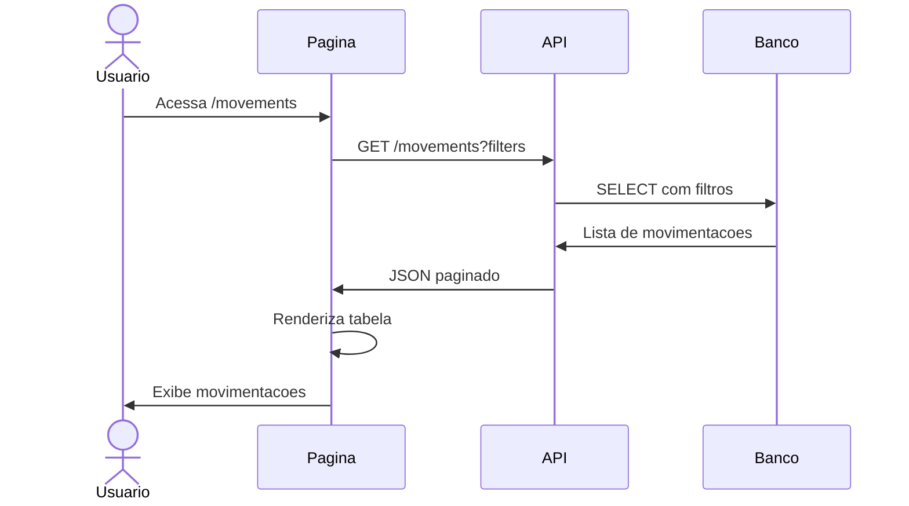

# UC-005: Consultar Movimentacoes

## 1. Informacoes Gerais

| Campo | Valor |
|-------|-------|
| **ID** | UC-005 |
| **Nome** | Consultar Movimentacoes |
| **Versao** | 1.0 |
| **Prioridade** | Alta |
| **Complexidade** | Media |
| **Status** | Implementado |

## 2. Descricao

Este caso de uso descreve a consulta do historico de movimentacoes, permitindo filtragem, ordenacao e exportacao de dados para analise e auditoria.

## 3. Atores

| Ator | Descricao |
|------|-----------|
| **Todos os Perfis** | Admin, Operador e Visualizador |

## 4. Pre-condicoes

- Usuario autenticado no sistema
- Movimentacoes existentes no sistema

## 5. Pos-condicoes

### Sucesso
- Lista de movimentacoes exibida conforme filtros
- Dados podem ser exportados

### Falha
- Mensagem informando ausencia de dados

## 6. Fluxo Principal



### Passos Detalhados

| Passo | Ator | Acao |
|-------|------|------|
| 1 | Usuario | Acessa menu "Movimentacoes" |
| 2 | Sistema | Aplica filtros padrao (ultimo mes) |
| 3 | Sistema | Busca movimentacoes da API |
| 4 | Sistema | Renderiza tabela com dados |
| 5 | Usuario | Visualiza historico de movimentacoes |

## 7. Fluxos Alternativos

### FA-01: Aplicar Filtros

| Passo | Acao |
|-------|------|
| 5a | Usuario clica em area de filtros |
| 5b | Usuario seleciona: periodo, produto, tanque, tipo, operador |
| 5c | Sistema recarrega dados filtrados |
| 5d | Tabela atualiza com resultados |

### FA-02: Ordenar Colunas

| Passo | Acao |
|-------|------|
| 5a | Usuario clica no cabecalho da coluna |
| 5b | Sistema ordena ASC/DESC |
| 5c | Indicador de ordenacao exibido |

### FA-03: Paginar Resultados

| Passo | Acao |
|-------|------|
| 5a | Usuario clica em numero de pagina |
| 5b | Sistema carrega pagina solicitada |
| 5c | Navegacao atualizada |

### FA-04: Exportar CSV

| Passo | Acao |
|-------|------|
| 5a | Usuario clica em "Exportar CSV" |
| 5b | Sistema gera arquivo com dados filtrados |
| 5c | Download automatico inicia |

### FA-05: Visualizar Detalhes

| Passo | Acao |
|-------|------|
| 5a | Usuario clica em linha da tabela |
| 5b | Sistema exibe modal com detalhes completos |
| 5c | Usuario visualiza todas as informacoes |

## 8. Excecoes

| Codigo | Condicao | Acao |
|--------|----------|------|
| EX-01 | Sem movimentacoes no periodo | Exibir "Nenhuma movimentacao encontrada" |
| EX-02 | Erro de conexao | Toast de erro com retry |
| EX-03 | Erro na exportacao | Mensagem de falha |

## 9. Regras de Negocio

| ID | Regra |
|----|-------|
| RN-01 | Filtro padrao: ultimo mes |
| RN-02 | Ordenacao padrao: data decrescente |
| RN-03 | Paginacao: 20 itens por pagina |
| RN-04 | Exportacao inclui todos os filtros aplicados |
| RN-05 | Visualizador nao ve dados de outros operadores (configuravel) |

## 10. Requisitos Nao-Funcionais

| ID | Requisito | Meta |
|----|-----------|------|
| RNF-01 | Tempo de listagem | < 2 segundos |
| RNF-02 | Suporte a registros | 100.000+ movimentacoes |
| RNF-03 | Exportacao | < 30 segundos para 10.000 registros |
| RNF-04 | Paginacao | Server-side |

## 11. Casos de Teste

| ID | Cenario | Entrada | Resultado Esperado |
|----|---------|---------|-------------------|
| TC-005-01 | Listar movimentacoes | Acesso a pagina | Tabela com dados |
| TC-005-02 | Filtrar por periodo | Selecionar "Hoje" | Apenas movimentacoes do dia |
| TC-005-03 | Filtrar por produto | Selecionar "Alcool" | Apenas movimentacoes de alcool |
| TC-005-04 | Filtrar por tipo | Selecionar "Saida" | Apenas saidas |
| TC-005-05 | Ordenar por data | Clicar na coluna | Dados ordenados |
| TC-005-06 | Exportar CSV | Clicar exportar | Download do arquivo |
| TC-005-07 | Sem resultados | Filtro sem dados | Mensagem apropriada |

## 12. Dependencias

### Casos de Uso Relacionados

| UC | Relacao |
|----|---------|
| UC-001 | Autenticar Usuario (pre-requisito) |
| UC-004 | Registrar Movimentacao (origem dos dados) |

### Componentes Tecnicos

| Componente | Arquivo |
|------------|---------|
| Pagina Movimentacoes | `/src/pages/Movements.tsx` |
| API Service | `/src/services/api.ts` |
| Filter Context | `/src/contexts/FilterContext.tsx` |

## 13. Estrutura da Tabela

| Coluna | Tipo | Descricao |
|--------|------|-----------|
| Data/Hora | datetime | Timestamp da movimentacao |
| Tanque | string | Nome do tanque |
| Produto | string | Alcool/Cachaca |
| Tipo | badge | Entrada/Saida/Ajuste |
| Volume | number | Litros movimentados |
| Preco/L | currency | Preco por litro (saidas) |
| Valor Total | currency | Volume * Preco |
| Operador | string | Usuario responsavel |
| Referencia | string | NF, ordem, etc. |

## 14. Prototipo de Tela

```
+------------------------------------------------------------------+
| [Logo] TankControl                              [Usuario] [Tema]  |
+------------------------------------------------------------------+
| [Sidebar]  |  MOVIMENTACOES                    [Exportar CSV]    |
|            |                                                      |
| Dashboard  |  Filtros:                                           |
| Tanques    |  [Periodo: Ultimo Mes v] [Produto: Todos v]         |
| > Moviment.|  [Tanque: Todos v] [Tipo: Todos v] [Operador v]     |
| Precos     |                                                      |
| Relatorios |  +------------------------------------------------+ |
| Admin      |  | Data    | Tanque | Prod | Tipo   | Vol  | Valor | |
| Config     |  |---------|--------|------|--------|------|-------| |
|            |  | 14/01   | TQ-01  | Alc  | Saida  | 500L | 1.750 | |
|            |  | 14/01   | TQ-02  | Cac  | Entrada| 1000L| -     | |
|            |  | 13/01   | TQ-01  | Alc  | Saida  | 300L | 1.050 | |
|            |  | 13/01   | TQ-03  | Cac  | Ajuste | -50L | -     | |
|            |  | 12/01   | TQ-01  | Alc  | Saida  | 800L | 2.800 | |
|            |  | ...     | ...    | ...  | ...    | ...  | ...   | |
|            |  +------------------------------------------------+ |
|            |                                                      |
|            |  Resumo do Periodo:                                  |
|            |  Volume Total: 45.230 L | Valor: R$ 125.430         |
|            |  Lucro: R$ 36.230 | Margem: 28,9%                   |
|            |                                                      |
|            |  [< Anterior] Pagina 1 de 15 [Proxima >]            |
+------------------------------------------------------------------+
```

## 15. Formato de Exportacao CSV

```csv
Data,Hora,Tanque,Produto,Tipo,Volume_L,Preco_L,Valor_Total,Custo_Total,Lucro,Operador,Referencia,Notas
2026-01-14,10:30:00,TANQUE-01,Alcool,saida,500,3.50,1750.00,1050.00,700.00,joao.silva,NF-123456,
2026-01-14,09:15:00,TANQUE-02,Cachaca,entrada,1000,,,,,maria.santos,NF-789012,Producao lote 45
```

## 16. Historico de Alteracoes

| Versao | Data | Autor | Alteracao |
|--------|------|-------|-----------|
| 1.0 | Janeiro 2026 | Equipe | Criacao inicial |

---

**Documento:** UC-005-consultar-movimentacoes.md
**Ultima Atualizacao:** Janeiro 2026
