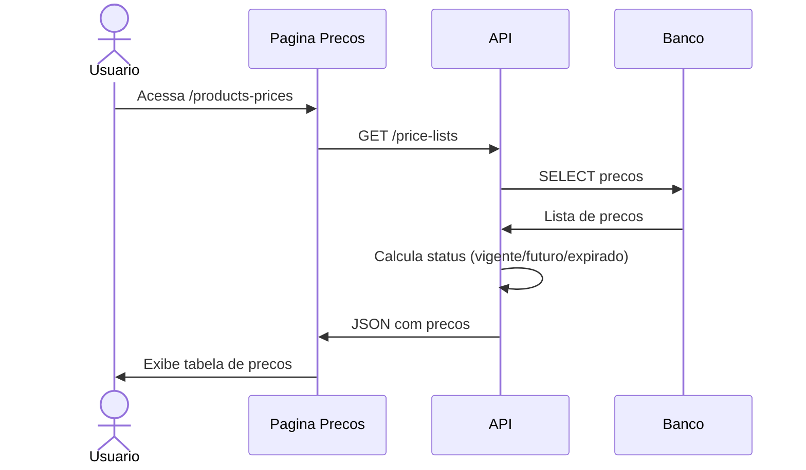
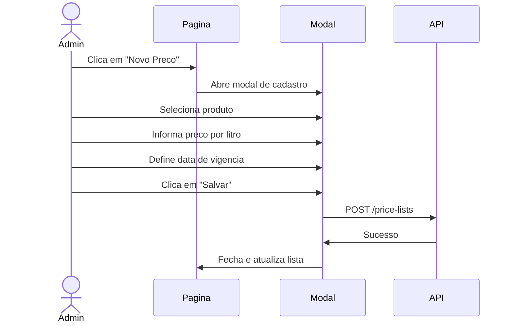

# UC-006: Gerenciar Precos

## 1. Informacoes Gerais

| Campo | Valor |
|-------|-------|
| **ID** | UC-006 |
| **Nome** | Gerenciar Precos |
| **Versao** | 1.0 |
| **Prioridade** | Media |
| **Complexidade** | Baixa |
| **Status** | Implementado |

## 2. Descricao

Este caso de uso descreve a gestao da tabela de precos por produto, incluindo consulta de precos vigentes, cadastro de novos precos e agendamento de precos futuros.

## 3. Atores

| Ator | Descricao |
|------|-----------|
| **Administrador** | Pode cadastrar e gerenciar precos |
| **Operador** | Pode visualizar precos vigentes |
| **Visualizador** | Pode visualizar precos |

## 4. Pre-condicoes

- Usuario autenticado no sistema
- Produtos cadastrados (Alcool, Cachaca)

## 5. Pos-condicoes

### Sucesso
- Tabela de precos atualizada
- Precos vigentes aplicados nas movimentacoes

### Falha
- Mensagem de erro
- Precos inalterados

## 6. Fluxo Principal



### Passos Detalhados

| Passo | Ator | Acao |
|-------|------|------|
| 1 | Usuario | Acessa menu "Produtos e Precos" |
| 2 | Sistema | Busca lista de precos |
| 3 | Sistema | Calcula status de cada preco |
| 4 | Sistema | Renderiza tabela |
| 5 | Usuario | Visualiza precos por produto |

## 7. Fluxos Alternativos

### FA-01: Cadastrar Novo Preco (Admin)



| Passo | Acao |
|-------|------|
| 5a | Admin clica em "Novo Preco" |
| 5b | Sistema exibe modal de cadastro |
| 5c | Admin seleciona produto (Alcool/Cachaca) |
| 5d | Admin informa preco por litro |
| 5e | Admin define data de inicio da vigencia |
| 5f | Admin clica em "Salvar" |
| 5g | Sistema valida e cadastra |
| 5h | Novo preco aparece na lista |

### FA-02: Visualizar Historico de Precos

| Passo | Acao |
|-------|------|
| 5a | Usuario seleciona produto |
| 5b | Sistema filtra precos do produto |
| 5c | Usuario visualiza evolucao de precos |

### FA-03: Agendar Preco Futuro

| Passo | Acao |
|-------|------|
| 5a | Admin cadastra preco com data futura |
| 5b | Sistema salva com status "futuro" |
| 5c | Na data de vigencia, preco torna-se "vigente" |
| 5d | Preco anterior torna-se "expirado" |

## 8. Excecoes

| Codigo | Condicao | Acao |
|--------|----------|------|
| EX-01 | Preco duplicado na mesma data | Erro "Ja existe preco para esta data" |
| EX-02 | Preco zero ou negativo | Erro "Preco deve ser maior que zero" |
| EX-03 | Data passada | Erro "Data deve ser hoje ou futura" |
| EX-04 | Sem permissao | Mensagem de acesso negado |

## 9. Regras de Negocio

| ID | Regra |
|----|-------|
| RN-01 | Cada produto tem apenas um preco vigente |
| RN-02 | Preco vigente: valid_from <= hoje e mais recente |
| RN-03 | Preco futuro: valid_from > hoje |
| RN-04 | Preco expirado: substituido por preco mais recente |
| RN-05 | Preco nao pode ser excluido (historico) |
| RN-06 | Preco sugerido em saidas vem do vigente |

## 10. Requisitos Nao-Funcionais

| ID | Requisito | Meta |
|----|-----------|------|
| RNF-01 | Tempo de listagem | < 1 segundo |
| RNF-02 | Atualizacao de status | Automatica |
| RNF-03 | Precisao | 2 casas decimais |

## 11. Casos de Teste

| ID | Cenario | Entrada | Resultado Esperado |
|----|---------|---------|-------------------|
| TC-006-01 | Listar precos | Acesso a pagina | Tabela com precos |
| TC-006-02 | Cadastrar preco | Dados validos | Preco criado |
| TC-006-03 | Preco duplicado | Mesma data/produto | Erro |
| TC-006-04 | Preco futuro | Data futura | Status "futuro" |
| TC-006-05 | Preco vigente | Data passada | Status "vigente" |
| TC-006-06 | Sem permissao | Operador tenta criar | Acesso negado |

## 12. Dependencias

### Casos de Uso Relacionados

| UC | Relacao |
|----|---------|
| UC-001 | Autenticar Usuario (pre-requisito) |
| UC-004 | Registrar Movimentacao (usa preco vigente) |

### Componentes Tecnicos

| Componente | Arquivo |
|------------|---------|
| Pagina Precos | `/src/pages/ProductsPrices.tsx` |
| API Service | `/src/services/api.ts` |
| Types | `/src/types/index.ts` |

## 13. Modelo de Dados

### Entidade PriceList

```typescript
interface PriceList {
  id: string;              // UUID
  product: "Alcool" | "Cachaca";
  valid_from: string;      // Data inicio vigencia (ISO)
  price_per_l: number;     // Preco por litro
  status: "vigente" | "futuro" | "expirado"; // Calculado
  created_at: string;      // Timestamp criacao
  created_by: string;      // Usuario que criou
}
```

## 14. Prototipo de Tela

```
+------------------------------------------------------------------+
| [Logo] TankControl                              [Usuario] [Tema]  |
+------------------------------------------------------------------+
| [Sidebar]  |  PRODUTOS E PRECOS                  [+ Novo Preco]  |
|            |                                                      |
| Dashboard  |  PRODUTOS                                           |
| Tanques    |  +------------------------------------------------+ |
| Moviment.  |  | Produto   | Descricao               | Precos    | |
| > Precos   |  |-----------|-------------------------|-----------|  |
| Relatorios |  | Alcool    | Alcool etilico 96%      | 2 precos  | |
| Admin      |  | Cachaca   | Cachaca artesanal       | 2 precos  | |
| Config     |  +------------------------------------------------+ |
|            |                                                      |
|            |  TABELA DE PRECOS                                   |
|            |  +------------------------------------------------+ |
|            |  | Produto | Vigencia   | Preco/L  | Status       | |
|            |  |---------|------------|----------|--------------|  |
|            |  | Alcool  | 01/01/2026 | R$ 3,50  | [Vigente]    | |
|            |  | Alcool  | 01/02/2026 | R$ 3,75  | [Futuro]     | |
|            |  | Cachaca | 01/01/2026 | R$ 4,00  | [Vigente]    | |
|            |  | Alcool  | 01/12/2025 | R$ 3,30  | [Expirado]   | |
|            |  +------------------------------------------------+ |
|            |                                                      |
+------------------------------------------------------------------+
```

## 15. Status de Preco

| Status | Cor | Condicao |
|--------|-----|----------|
| Vigente | Verde | Preco atual em uso |
| Futuro | Azul | Aguardando data de inicio |
| Expirado | Cinza | Substituido por novo preco |

## 16. Historico de Alteracoes

| Versao | Data | Autor | Alteracao |
|--------|------|-------|-----------|
| 1.0 | Janeiro 2026 | Equipe | Criacao inicial |

---

**Documento:** UC-006-gerenciar-precos.md
**Ultima Atualizacao:** Janeiro 2026
