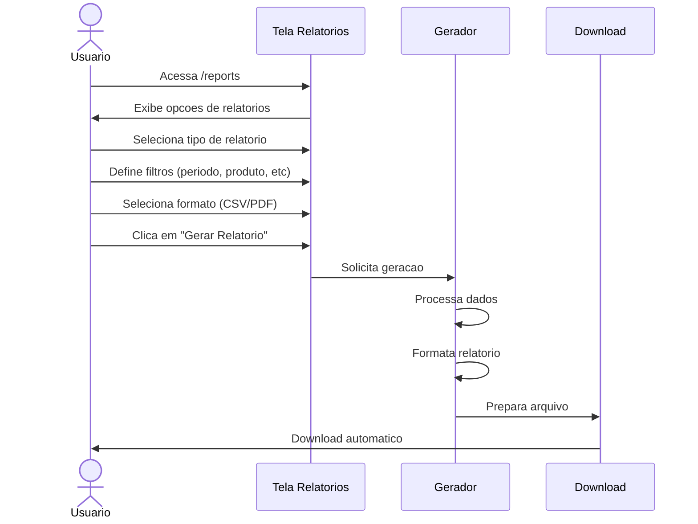

# UC-007: Exportar Relatorios

## 1. Informacoes Gerais

| Campo | Valor |
|-------|-------|
| **ID** | UC-007 |
| **Nome** | Exportar Relatorios |
| **Versao** | 1.0 |
| **Prioridade** | Media |
| **Complexidade** | Media |
| **Status** | Implementado (Parcial) |

## 2. Descricao

Este caso de uso descreve a geracao e exportacao de relatorios do sistema em diferentes formatos (CSV, PDF), permitindo analise offline e compartilhamento de informacoes.

## 3. Atores

| Ator | Descricao |
|------|-----------|
| **Administrador** | Acesso a todos os relatorios |
| **Operador** | Relatorios operacionais |
| **Visualizador** | Relatorios basicos |

## 4. Pre-condicoes

- Usuario autenticado no sistema
- Dados existentes para o periodo selecionado

## 5. Pos-condicoes

### Sucesso
- Arquivo gerado e baixado
- Log de exportacao registrado

### Falha
- Mensagem de erro
- Sem download

## 6. Fluxo Principal



### Passos Detalhados

| Passo | Ator | Acao |
|-------|------|------|
| 1 | Usuario | Acessa menu "Relatorios" |
| 2 | Sistema | Exibe tipos de relatorios disponiveis |
| 3 | Usuario | Seleciona tipo de relatorio |
| 4 | Usuario | Define filtros desejados |
| 5 | Usuario | Seleciona formato de saida |
| 6 | Usuario | Clica em "Gerar Relatorio" |
| 7 | Sistema | Processa e gera arquivo |
| 8 | Sistema | Inicia download automatico |

## 7. Fluxos Alternativos

### FA-01: Relatorio de Vendas

| Passo | Acao |
|-------|------|
| 3a | Usuario seleciona "Relatorio de Vendas" |
| 4a | Sistema exibe filtros: periodo, produto, tanque |
| 7a | Relatorio inclui: volume, valor, lucro, margem |

### FA-02: Relatorio de Estoque

| Passo | Acao |
|-------|------|
| 3a | Usuario seleciona "Relatorio de Estoque" |
| 4a | Sistema exibe filtros: data, site |
| 7a | Relatorio inclui: tanques, volumes, capacidades |

### FA-03: Relatorio Financeiro

| Passo | Acao |
|-------|------|
| 3a | Usuario seleciona "Relatorio Financeiro" |
| 4a | Sistema exibe filtros: periodo, agrupamento |
| 7a | Relatorio inclui: faturamento, custos, lucro, margem |

### FA-04: Relatorio de Movimentacoes

| Passo | Acao |
|-------|------|
| 3a | Usuario seleciona "Relatorio de Movimentacoes" |
| 4a | Sistema exibe todos os filtros |
| 7a | Relatorio inclui: detalhamento de cada movimentacao |

## 8. Excecoes

| Codigo | Condicao | Acao |
|--------|----------|------|
| EX-01 | Sem dados no periodo | Mensagem "Nenhum dado encontrado" |
| EX-02 | Erro na geracao | Toast de erro |
| EX-03 | Timeout (muitos dados) | Sugerir filtro menor |
| EX-04 | Sem permissao | Acesso negado |

## 9. Regras de Negocio

| ID | Regra |
|----|-------|
| RN-01 | Relatorios respeitam filtros aplicados |
| RN-02 | CSV usa separador ponto-e-virgula (;) |
| RN-03 | PDF inclui cabecalho com data e usuario |
| RN-04 | Limite de 50.000 registros por exportacao |
| RN-05 | Exportacao registrada em log de auditoria |

## 10. Requisitos Nao-Funcionais

| ID | Requisito | Meta |
|----|-----------|------|
| RNF-01 | Tempo de geracao CSV | < 10 segundos |
| RNF-02 | Tempo de geracao PDF | < 30 segundos |
| RNF-03 | Tamanho maximo | 50MB |
| RNF-04 | Formato de data | DD/MM/YYYY |
| RNF-05 | Formato moeda | R$ #.###,## |

## 11. Casos de Teste

| ID | Cenario | Entrada | Resultado Esperado |
|----|---------|---------|-------------------|
| TC-007-01 | Exportar vendas CSV | Dados validos | Arquivo CSV baixado |
| TC-007-02 | Exportar vendas PDF | Dados validos | Arquivo PDF baixado |
| TC-007-03 | Exportar estoque | Selecionar data | Posicao de estoque |
| TC-007-04 | Sem dados | Filtro sem resultados | Mensagem apropriada |
| TC-007-05 | Muitos dados | Periodo extenso | Timeout ou sucesso |

## 12. Dependencias

### Casos de Uso Relacionados

| UC | Relacao |
|----|---------|
| UC-001 | Autenticar Usuario (pre-requisito) |
| UC-004 | Registrar Movimentacao (dados origem) |
| UC-005 | Consultar Movimentacoes (dados origem) |

### Componentes Tecnicos

| Componente | Arquivo |
|------------|---------|
| Pagina Relatorios | `/src/pages/Reports.tsx` |
| API Service | `/src/services/api.ts` |

## 13. Tipos de Relatorios

### 13.1 Relatorio de Vendas

| Campo | Tipo | Descricao |
|-------|------|-----------|
| Periodo | date range | Inicio e fim |
| Produto | string | Filtro por produto |
| Volume Total | number | Soma dos volumes |
| Valor Total | currency | Soma dos valores |
| Lucro Total | currency | Soma dos lucros |
| Margem Media | percent | Media ponderada |
| Qtd Operacoes | number | Contagem de saidas |

### 13.2 Relatorio de Estoque

| Campo | Tipo | Descricao |
|-------|------|-----------|
| Data Base | date | Data do snapshot |
| Tanque | string | Identificacao |
| Produto | string | Tipo de liquido |
| Volume Atual | number | Litros |
| Capacidade | number | Capacidade total |
| Ocupacao | percent | % da capacidade |
| Valor Estimado | currency | Volume * preco |

### 13.3 Relatorio Financeiro

| Campo | Tipo | Descricao |
|-------|------|-----------|
| Periodo | date range | Inicio e fim |
| Faturamento | currency | Total de vendas |
| COGS | currency | Custo dos produtos |
| Lucro Bruto | currency | Faturamento - COGS |
| Margem Bruta | percent | Lucro / Faturamento |
| Ticket Medio | currency | Faturamento / Vendas |

### 13.4 Relatorio de Movimentacoes

| Campo | Tipo | Descricao |
|-------|------|-----------|
| Data/Hora | datetime | Timestamp |
| Tanque | string | Nome do tanque |
| Tipo | string | Entrada/Saida/Ajuste |
| Volume | number | Litros |
| Preco | currency | Por litro |
| Valor | currency | Total |
| Operador | string | Responsavel |
| Referencia | string | NF, ordem |

## 14. Prototipo de Tela

```
+------------------------------------------------------------------+
| [Logo] TankControl                              [Usuario] [Tema]  |
+------------------------------------------------------------------+
| [Sidebar]  |  RELATORIOS                                         |
|            |                                                      |
| Dashboard  |  Selecione o tipo de relatorio:                     |
| Tanques    |                                                      |
| Moviment.  |  +------------------+ +------------------+           |
| Precos     |  | [icon] VENDAS    | | [icon] ESTOQUE   |           |
| > Relat.   |  | Volume, valor,   | | Posicao atual    |           |
| Admin      |  | lucro por periodo| | dos tanques      |           |
| Config     |  +------------------+ +------------------+           |
|            |                                                      |
|            |  +------------------+ +------------------+           |
|            |  | [icon] FINANCEIRO| | [icon] MOVIMENT. |           |
|            |  | Faturamento,     | | Historico        |           |
|            |  | custos, margem   | | detalhado        |           |
|            |  +------------------+ +------------------+           |
|            |                                                      |
|            |  +------------------------------------------------+ |
|            |  | FILTROS                                         | |
|            |  |                                                 | |
|            |  | Periodo: [01/01/2026] ate [14/01/2026]          | |
|            |  |                                                 | |
|            |  | Produto: [Todos v]  Tanque: [Todos v]           | |
|            |  |                                                 | |
|            |  | Formato: ( ) CSV  (x) PDF                       | |
|            |  |                                                 | |
|            |  | [        GERAR RELATORIO        ]              | |
|            |  +------------------------------------------------+ |
|            |                                                      |
+------------------------------------------------------------------+
```

## 15. Exemplo de Saida CSV

```csv
Relatorio de Vendas - Periodo: 01/01/2026 a 14/01/2026
Gerado em: 14/01/2026 10:30:00
Usuario: admin@empresa.com

Data;Tanque;Produto;Volume_L;Preco_L;Valor_Total;Lucro
14/01/2026;TANQUE-01;Alcool;500;3,50;1750,00;700,00
14/01/2026;TANQUE-02;Cachaca;300;4,00;1200,00;480,00
...

TOTAIS
Volume Total:;45.230 L
Valor Total:;R$ 125.430,00
Lucro Total:;R$ 36.230,00
Margem Media:;28,9%
```

## 16. Historico de Alteracoes

| Versao | Data | Autor | Alteracao |
|--------|------|-------|-----------|
| 1.0 | Janeiro 2026 | Equipe | Criacao inicial |

---

**Documento:** UC-007-exportar-relatorios.md
**Ultima Atualizacao:** Janeiro 2026
