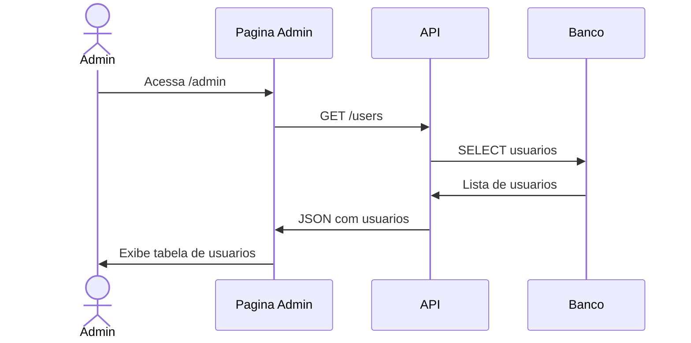
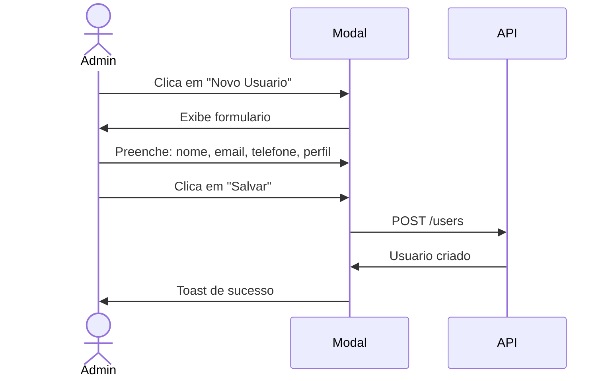

# UC-008: Gerenciar Usuarios

## 1. Informacoes Gerais

| Campo | Valor |
|-------|-------|
| **ID** | UC-008 |
| **Nome** | Gerenciar Usuarios |
| **Versao** | 1.0 |
| **Prioridade** | Alta |
| **Complexidade** | Media |
| **Status** | Implementado (Parcial) |

## 2. Descricao

Este caso de uso descreve a gestao de usuarios do sistema, incluindo cadastro, edicao, ativacao/desativacao e atribuicao de perfis de acesso.

## 3. Atores

| Ator | Descricao |
|------|-----------|
| **Administrador** | Unico perfil com acesso a gestao de usuarios |

## 4. Pre-condicoes

- Usuario autenticado como Administrador
- Sistema operacional

## 5. Pos-condicoes

### Sucesso
- Usuario criado/atualizado no sistema
- Permissoes aplicadas

### Falha
- Mensagem de erro
- Dados inalterados

## 6. Fluxo Principal



### Passos Detalhados

| Passo | Ator | Acao |
|-------|------|------|
| 1 | Admin | Acessa menu "Administracao" |
| 2 | Sistema | Busca lista de usuarios |
| 3 | Sistema | Renderiza tabela |
| 4 | Admin | Visualiza usuarios cadastrados |

## 7. Fluxos Alternativos

### FA-01: Cadastrar Novo Usuario



| Passo | Acao |
|-------|------|
| 4a | Admin clica em "Novo Usuario" |
| 4b | Sistema exibe formulario |
| 4c | Admin preenche nome completo |
| 4d | Admin preenche email (login) |
| 4e | Admin preenche telefone (opcional) |
| 4f | Admin seleciona perfil (Admin/Operador/Viewer) |
| 4g | Admin clica em "Salvar" |
| 4h | Sistema valida e cria usuario |
| 4i | Email de boas-vindas enviado (opcional) |

### FA-02: Editar Usuario

| Passo | Acao |
|-------|------|
| 4a | Admin clica em "Editar" na linha do usuario |
| 4b | Sistema exibe formulario com dados atuais |
| 4c | Admin altera campos desejados |
| 4d | Admin clica em "Salvar" |
| 4e | Sistema valida e atualiza |

### FA-03: Ativar/Desativar Usuario

| Passo | Acao |
|-------|------|
| 4a | Admin clica em toggle de status |
| 4b | Sistema exibe confirmacao |
| 4c | Admin confirma acao |
| 4d | Sistema altera status do usuario |
| 4e | Usuario desativado perde acesso imediato |

### FA-04: Alterar Perfil

| Passo | Acao |
|-------|------|
| 4a | Admin edita usuario |
| 4b | Admin altera campo "Perfil" |
| 4c | Sistema atualiza permissoes |
| 4d | Novas permissoes aplicadas no proximo login |

### FA-05: Resetar Senha

| Passo | Acao |
|-------|------|
| 4a | Admin clica em "Resetar Senha" |
| 4b | Sistema gera link de redefinicao |
| 4c | Email enviado ao usuario |
| 4d | Usuario define nova senha |

## 8. Excecoes

| Codigo | Condicao | Acao |
|--------|----------|------|
| EX-01 | Email ja cadastrado | Erro "Email ja existe no sistema" |
| EX-02 | Email invalido | Erro "Formato de email invalido" |
| EX-03 | Desativar proprio usuario | Erro "Nao e possivel desativar sua conta" |
| EX-04 | Ultimo admin | Erro "Sistema requer ao menos 1 admin" |
| EX-05 | Sem permissao | Acesso negado |

## 9. Regras de Negocio

| ID | Regra |
|----|-------|
| RN-01 | Email deve ser unico no sistema |
| RN-02 | Deve existir ao menos 1 usuario Admin |
| RN-03 | Usuario nao pode desativar a si mesmo |
| RN-04 | Senha inicial gerada pelo sistema |
| RN-05 | Usuario desativado perde acesso imediato |
| RN-06 | Historico de usuario preservado mesmo inativo |

## 10. Requisitos Nao-Funcionais

| ID | Requisito | Meta |
|----|-----------|------|
| RNF-01 | Senha minima | 8 caracteres |
| RNF-02 | Criptografia | bcrypt |
| RNF-03 | Tentativas de login | Max 5 antes de bloqueio |
| RNF-04 | Auditoria | Log de todas alteracoes |

## 11. Casos de Teste

| ID | Cenario | Entrada | Resultado Esperado |
|----|---------|---------|-------------------|
| TC-008-01 | Listar usuarios | Acesso como Admin | Tabela com usuarios |
| TC-008-02 | Criar usuario | Dados validos | Usuario criado |
| TC-008-03 | Email duplicado | Email existente | Erro |
| TC-008-04 | Desativar usuario | Outro usuario | Status alterado |
| TC-008-05 | Desativar proprio | Proprio usuario | Erro |
| TC-008-06 | Ultimo admin | Tentar desativar | Erro |
| TC-008-07 | Alterar perfil | Mudar para Operador | Permissoes atualizadas |
| TC-008-08 | Acesso negado | Operador tenta acessar | Bloqueado |

## 12. Dependencias

### Casos de Uso Relacionados

| UC | Relacao |
|----|---------|
| UC-001 | Autenticar Usuario (usa dados de usuario) |

### Componentes Tecnicos

| Componente | Arquivo |
|------------|---------|
| Pagina Admin | `/src/pages/Admin.tsx` |
| API Service | `/src/services/api.ts` |
| Types | `/src/types/index.ts` |

## 13. Modelo de Dados

### Entidade User

```typescript
interface User {
  id: string;              // UUID
  name: string;            // Nome completo
  email: string;           // Email (login)
  phone?: string;          // Telefone (opcional)
  role: "admin" | "operador" | "viewer";
  status: "active" | "inactive";
  created_at: string;      // Timestamp criacao
  updated_at: string;      // Ultima atualizacao
  last_login?: string;     // Ultimo acesso
}
```

## 14. Perfis e Permissoes

| Funcionalidade | Admin | Operador | Viewer |
|----------------|-------|----------|--------|
| Dashboard | Sim | Sim | Sim |
| Visualizar Tanques | Sim | Sim | Sim |
| Cadastrar Tanques | Sim | Nao | Nao |
| Registrar Movimentacao | Sim | Sim | Nao |
| Gerenciar Precos | Sim | Nao | Nao |
| Exportar Relatorios | Sim | Sim | Sim |
| Gerenciar Usuarios | Sim | Nao | Nao |
| Configuracoes | Sim | Nao | Nao |
| Reset de Dados | Sim | Nao | Nao |

## 15. Prototipo de Tela

```
+------------------------------------------------------------------+
| [Logo] TankControl                              [Usuario] [Tema]  |
+------------------------------------------------------------------+
| [Sidebar]  |  ADMINISTRACAO                      [+ Novo Usuario]|
|            |                                                      |
| Dashboard  |  USUARIOS                                           |
| Tanques    |  +------------------------------------------------+ |
| Moviment.  |  | Nome        | Email         | Perfil | Status  | |
| Precos     |  |-------------|---------------|--------|---------|  |
| Relatorios |  | Joao Silva  | joao@emp.com  | Admin  | [Ativo] | |
| > Admin    |  | Maria Santos| maria@emp.com | Operad.| [Ativo] | |
| Config     |  | Pedro Lima  | pedro@emp.com | Viewer | [Inativo]| |
|            |  | Ana Costa   | ana@emp.com   | Operad.| [Ativo] | |
|            |  +------------------------------------------------+ |
|            |                                                      |
|            |  +------------------------------------------------+ |
|            |  | ACOES DO SISTEMA                                | |
|            |  |                                                 | |
|            |  | [Reset Dados Demo] - Restaura dados iniciais    | |
|            |  +------------------------------------------------+ |
|            |                                                      |
+------------------------------------------------------------------+
```

## 16. Formulario de Usuario

```
+------------------------------------------+
|           NOVO USUARIO                   |
+------------------------------------------+
|                                          |
|  Nome Completo: *                        |
|  +------------------------------------+  |
|  | Joao da Silva                      |  |
|  +------------------------------------+  |
|                                          |
|  Email: *                                |
|  +------------------------------------+  |
|  | joao.silva@empresa.com             |  |
|  +------------------------------------+  |
|                                          |
|  Telefone:                               |
|  +------------------------------------+  |
|  | (11) 99999-9999                    |  |
|  +------------------------------------+  |
|                                          |
|  Perfil: *                               |
|  +------------------------------------+  |
|  | Operador                       [v] |  |
|  +------------------------------------+  |
|                                          |
|  Permissoes do perfil selecionado:       |
|  - Visualizar dashboard e tanques        |
|  - Registrar movimentacoes               |
|  - Exportar relatorios                   |
|                                          |
|  +------------------+ +----------------+ |
|  |    Cancelar      | |     Salvar     | |
|  +------------------+ +----------------+ |
|                                          |
+------------------------------------------+
```

## 17. Historico de Alteracoes

| Versao | Data | Autor | Alteracao |
|--------|------|-------|-----------|
| 1.0 | Janeiro 2026 | Equipe | Criacao inicial |

---

**Documento:** UC-008-gerenciar-usuarios.md
**Ultima Atualizacao:** Janeiro 2026
