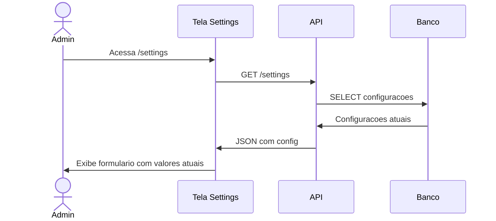

# UC-009: Configurar Sistema

## 1. Informacoes Gerais

| Campo | Valor |
|-------|-------|
| **ID** | UC-009 |
| **Nome** | Configurar Sistema |
| **Versao** | 1.0 |
| **Prioridade** | Media |
| **Complexidade** | Baixa |
| **Status** | Implementado |

## 2. Descricao

Este caso de uso descreve a configuracao de parametros do sistema, incluindo limites e alertas, politicas de bloqueio, preferencias de interface e configuracoes de notificacao.

## 3. Atores

| Ator | Descricao |
|------|-----------|
| **Administrador** | Unico perfil com acesso as configuracoes |

## 4. Pre-condicoes

- Usuario autenticado como Administrador
- Sistema operacional

## 5. Pos-condicoes

### Sucesso
- Configuracoes salvas e aplicadas
- Sistema opera conforme novos parametros

### Falha
- Mensagem de erro
- Configuracoes anteriores mantidas

## 6. Fluxo Principal



### Passos Detalhados

| Passo | Ator | Acao |
|-------|------|------|
| 1 | Admin | Acessa menu "Configuracoes" |
| 2 | Sistema | Carrega configuracoes atuais |
| 3 | Sistema | Exibe formularios organizados por secao |
| 4 | Admin | Visualiza e edita parametros |

## 7. Fluxos Alternativos

### FA-01: Configurar Limites e Alertas

| Passo | Acao |
|-------|------|
| 4a | Admin acessa secao "Limites e Alertas" |
| 4b | Admin define percentual de volume minimo |
| 4c | Admin define margem de seguranca |
| 4d | Admin clica em "Salvar" |
| 4e | Sistema aplica novos limiares |

### FA-02: Configurar Politica de Bloqueio

| Passo | Acao |
|-------|------|
| 4a | Admin acessa secao "Politica de Bloqueio" |
| 4b | Admin ativa/desativa bloqueio por saldo negativo |
| 4c | Admin ativa/desativa bloqueio por capacidade |
| 4d | Admin salva configuracoes |

### FA-03: Configurar Interface

| Passo | Acao |
|-------|------|
| 4a | Admin acessa secao "Interface" |
| 4b | Admin define formato de data |
| 4c | Admin define formato de moeda |
| 4d | Admin define fuso horario |
| 4e | Admin salva preferencias |

### FA-04: Configurar Notificacoes

| Passo | Acao |
|-------|------|
| 4a | Admin acessa secao "Notificacoes" |
| 4b | Admin ativa/desativa alertas por email |
| 4c | Admin configura destinatarios |
| 4d | Admin define tipos de alerta |
| 4e | Admin salva configuracoes |

## 8. Excecoes

| Codigo | Condicao | Acao |
|--------|----------|------|
| EX-01 | Valor fora do range | Erro "Valor deve estar entre X e Y" |
| EX-02 | Erro ao salvar | Toast de erro com retry |
| EX-03 | Sem permissao | Acesso negado |
| EX-04 | Configuracao invalida | Mensagem especifica |

## 9. Regras de Negocio

| ID | Regra |
|----|-------|
| RN-01 | Volume minimo de alerta: 5% a 30% da capacidade |
| RN-02 | Margem de seguranca: 0% a 10% |
| RN-03 | Bloqueio de saldo negativo: padrao ativado |
| RN-04 | Bloqueio de capacidade: padrao ativado |
| RN-05 | Alteracoes aplicam-se imediatamente |

## 10. Requisitos Nao-Funcionais

| ID | Requisito | Meta |
|----|-----------|------|
| RNF-01 | Tempo de salvamento | < 1 segundo |
| RNF-02 | Persistencia | Banco de dados |
| RNF-03 | Cache | Invalidar apos alteracao |

## 11. Casos de Teste

| ID | Cenario | Entrada | Resultado Esperado |
|----|---------|---------|-------------------|
| TC-009-01 | Carregar config | Acesso a pagina | Valores atuais exibidos |
| TC-009-02 | Alterar volume minimo | 15% | Salvo e aplicado |
| TC-009-03 | Valor invalido | -5% | Erro de validacao |
| TC-009-04 | Desativar bloqueio | Toggle off | Bloqueio desativado |
| TC-009-05 | Ativar email | Toggle on | Email configurado |

## 12. Dependencias

### Casos de Uso Relacionados

| UC | Relacao |
|----|---------|
| UC-001 | Autenticar Usuario (pre-requisito) |
| UC-003 | Gerenciar Tanques (usa config de alerta) |
| UC-004 | Registrar Movimentacao (usa politica de bloqueio) |

### Componentes Tecnicos

| Componente | Arquivo |
|------------|---------|
| Pagina Settings | `/src/pages/Settings.tsx` |
| API Service | `/src/services/api.ts` |

## 13. Categorias de Configuracao

### 13.1 Limites e Alertas

| Parametro | Tipo | Default | Range |
|-----------|------|---------|-------|
| Volume Minimo de Alerta | % | 10% | 5-30% |
| Margem de Seguranca | % | 5% | 0-10% |

### 13.2 Politica de Bloqueio

| Parametro | Tipo | Default |
|-----------|------|---------|
| Bloquear Saldo Negativo | boolean | true |
| Bloquear Capacidade Excedida | boolean | true |
| Exigir Preco em Saida | boolean | true |

### 13.3 Preferencias de Interface

| Parametro | Tipo | Default |
|-----------|------|---------|
| Formato de Data | string | DD/MM/YYYY |
| Formato de Moeda | string | R$ #.###,## |
| Fuso Horario | string | America/Sao_Paulo |
| Tema Padrao | string | light |

### 13.4 Notificacoes

| Parametro | Tipo | Default |
|-----------|------|---------|
| Alertas por Email | boolean | false |
| Alertas no Sistema | boolean | true |
| Email de Destino | string | - |
| Tipos de Alerta | array | [estoque_baixo] |

## 14. Prototipo de Tela

```
+------------------------------------------------------------------+
| [Logo] TankControl                              [Usuario] [Tema]  |
+------------------------------------------------------------------+
| [Sidebar]  |  CONFIGURACOES                                      |
|            |                                                      |
| Dashboard  |  LIMITES E ALERTAS                                  |
| Tanques    |  +------------------------------------------------+ |
| Moviment.  |  | Volume Minimo de Alerta                         | |
| Precos     |  | [ 10 ] %                                        | |
| Relatorios |  |                                                 | |
| Admin      |  | Margem de Seguranca                             | |
| > Config   |  | [ 5 ] %                                         | |
|            |  +------------------------------------------------+ |
|            |                                                      |
|            |  POLITICA DE BLOQUEIO                               |
|            |  +------------------------------------------------+ |
|            |  | [x] Bloquear operacoes que resultem em          | |
|            |  |     saldo negativo                              | |
|            |  |                                                 | |
|            |  | [x] Bloquear entradas que excedam a             | |
|            |  |     capacidade do tanque                        | |
|            |  +------------------------------------------------+ |
|            |                                                      |
|            |  PREFERENCIAS DE INTERFACE                          |
|            |  +------------------------------------------------+ |
|            |  | Formato de Data: [DD/MM/YYYY v]                 | |
|            |  | Fuso Horario: [America/Sao_Paulo v]             | |
|            |  +------------------------------------------------+ |
|            |                                                      |
|            |  NOTIFICACOES                                        |
|            |  +------------------------------------------------+ |
|            |  | [ ] Receber alertas por email                   | |
|            |  | [x] Exibir alertas no sistema                   | |
|            |  +------------------------------------------------+ |
|            |                                                      |
|            |  [           SALVAR CONFIGURACOES           ]       |
|            |                                                      |
+------------------------------------------------------------------+
```

## 15. Historico de Alteracoes

| Versao | Data | Autor | Alteracao |
|--------|------|-------|-----------|
| 1.0 | Janeiro 2026 | Equipe | Criacao inicial |

---

**Documento:** UC-009-configurar-sistema.md
**Ultima Atualizacao:** Janeiro 2026
