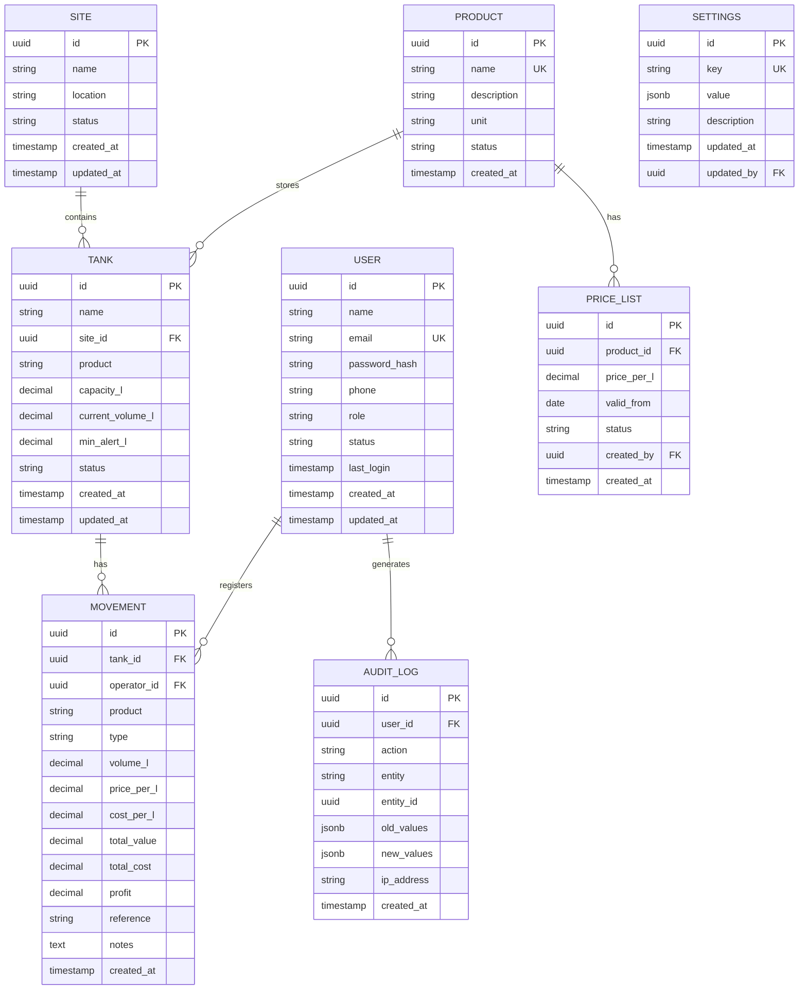
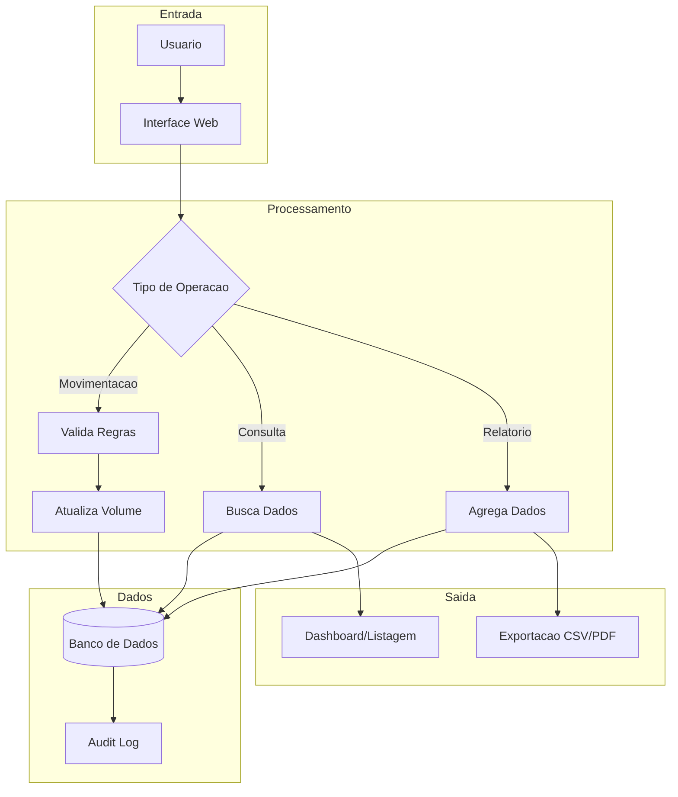

# DER-001: Diagrama Entidade-Relacionamento Completo

## Informacoes Gerais

| Campo | Valor |
|-------|-------|
| **ID** | DER-001 |
| **Nome** | Modelo de Dados Completo |
| **Versao** | 1.0 |
| **Data** | Janeiro 2026 |
| **Status** | Aprovado |

## 1. Visao Geral

Este documento apresenta o modelo de dados completo do sistema Liquid Flow Monitor, incluindo todas as entidades, relacionamentos e restricoes de integridade.

## 2. Diagrama Entidade-Relacionamento



## 3. Descricao das Entidades

### 3.1 SITE (Unidade/Filial)

Representa as unidades fisicas onde os tanques estao localizados.

| Coluna | Tipo | Nulo | Descricao |
|--------|------|------|-----------|
| id | UUID | Nao | Identificador unico |
| name | VARCHAR(100) | Nao | Nome da unidade |
| location | VARCHAR(255) | Sim | Endereco/localizacao |
| status | VARCHAR(20) | Nao | active, inactive |
| created_at | TIMESTAMP | Nao | Data de criacao |
| updated_at | TIMESTAMP | Nao | Data de atualizacao |

### 3.2 TANK (Tanque)

Representa os tanques de armazenamento de liquidos.

| Coluna | Tipo | Nulo | Descricao |
|--------|------|------|-----------|
| id | UUID | Nao | Identificador unico |
| name | VARCHAR(100) | Nao | Nome do tanque |
| site_id | UUID | Nao | FK para SITE |
| product | VARCHAR(50) | Nao | Alcool, Cachaca, Ambos |
| capacity_l | DECIMAL(12,2) | Nao | Capacidade em litros |
| current_volume_l | DECIMAL(12,2) | Nao | Volume atual |
| min_alert_l | DECIMAL(12,2) | Nao | Volume minimo alerta |
| status | VARCHAR(20) | Nao | active, inactive, maintenance |
| created_at | TIMESTAMP | Nao | Data de criacao |
| updated_at | TIMESTAMP | Nao | Data de atualizacao |

### 3.3 MOVEMENT (Movimentacao)

Registra todas as movimentacoes de liquidos nos tanques.

| Coluna | Tipo | Nulo | Descricao |
|--------|------|------|-----------|
| id | UUID | Nao | Identificador unico |
| tank_id | UUID | Nao | FK para TANK |
| operator_id | UUID | Nao | FK para USER |
| product | VARCHAR(50) | Nao | Produto movimentado |
| type | VARCHAR(20) | Nao | entrada, saida, ajuste |
| volume_l | DECIMAL(12,2) | Nao | Volume em litros |
| price_per_l | DECIMAL(10,4) | Sim | Preco por litro (saida) |
| cost_per_l | DECIMAL(10,4) | Sim | Custo por litro |
| total_value | DECIMAL(14,2) | Sim | Valor total |
| total_cost | DECIMAL(14,2) | Sim | Custo total |
| profit | DECIMAL(14,2) | Sim | Lucro |
| reference | VARCHAR(100) | Sim | NF, ordem |
| notes | TEXT | Sim | Observacoes |
| created_at | TIMESTAMP | Nao | Data/hora da movimentacao |

### 3.4 USER (Usuario)

Armazena os usuarios do sistema.

| Coluna | Tipo | Nulo | Descricao |
|--------|------|------|-----------|
| id | UUID | Nao | Identificador unico |
| name | VARCHAR(150) | Nao | Nome completo |
| email | VARCHAR(255) | Nao | Email (login) - UNIQUE |
| password_hash | VARCHAR(255) | Nao | Hash da senha |
| phone | VARCHAR(20) | Sim | Telefone |
| role | VARCHAR(20) | Nao | admin, operador, viewer |
| status | VARCHAR(20) | Nao | active, inactive |
| last_login | TIMESTAMP | Sim | Ultimo acesso |
| created_at | TIMESTAMP | Nao | Data de criacao |
| updated_at | TIMESTAMP | Nao | Data de atualizacao |

### 3.5 PRODUCT (Produto)

Catalogo de produtos (tipos de liquidos).

| Coluna | Tipo | Nulo | Descricao |
|--------|------|------|-----------|
| id | UUID | Nao | Identificador unico |
| name | VARCHAR(100) | Nao | Nome - UNIQUE |
| description | VARCHAR(255) | Sim | Descricao |
| unit | VARCHAR(10) | Nao | Unidade (L) |
| status | VARCHAR(20) | Nao | active, inactive |
| created_at | TIMESTAMP | Nao | Data de criacao |

### 3.6 PRICE_LIST (Tabela de Precos)

Historico de precos por produto.

| Coluna | Tipo | Nulo | Descricao |
|--------|------|------|-----------|
| id | UUID | Nao | Identificador unico |
| product_id | UUID | Nao | FK para PRODUCT |
| price_per_l | DECIMAL(10,4) | Nao | Preco por litro |
| valid_from | DATE | Nao | Inicio da vigencia |
| status | VARCHAR(20) | Nao | vigente, futuro, expirado |
| created_by | UUID | Nao | FK para USER |
| created_at | TIMESTAMP | Nao | Data de criacao |

### 3.7 AUDIT_LOG (Log de Auditoria)

Registra todas as acoes no sistema.

| Coluna | Tipo | Nulo | Descricao |
|--------|------|------|-----------|
| id | UUID | Nao | Identificador unico |
| user_id | UUID | Sim | FK para USER |
| action | VARCHAR(50) | Nao | CREATE, UPDATE, DELETE, LOGIN |
| entity | VARCHAR(50) | Nao | Nome da entidade |
| entity_id | UUID | Sim | ID da entidade |
| old_values | JSONB | Sim | Valores anteriores |
| new_values | JSONB | Sim | Novos valores |
| ip_address | VARCHAR(45) | Sim | IP do usuario |
| created_at | TIMESTAMP | Nao | Data/hora da acao |

### 3.8 SETTINGS (Configuracoes)

Parametros de configuracao do sistema.

| Coluna | Tipo | Nulo | Descricao |
|--------|------|------|-----------|
| id | UUID | Nao | Identificador unico |
| key | VARCHAR(100) | Nao | Chave - UNIQUE |
| value | JSONB | Nao | Valor (JSON) |
| description | VARCHAR(255) | Sim | Descricao |
| updated_at | TIMESTAMP | Nao | Ultima atualizacao |
| updated_by | UUID | Sim | FK para USER |

## 4. Relacionamentos

| Origem | Destino | Cardinalidade | Descricao |
|--------|---------|---------------|-----------|
| SITE | TANK | 1:N | Um site possui muitos tanques |
| TANK | MOVEMENT | 1:N | Um tanque tem muitas movimentacoes |
| USER | MOVEMENT | 1:N | Um usuario registra muitas movimentacoes |
| PRODUCT | TANK | 1:N | Um produto pode estar em muitos tanques |
| PRODUCT | PRICE_LIST | 1:N | Um produto tem varios precos (historico) |
| USER | AUDIT_LOG | 1:N | Um usuario gera muitos logs |
| USER | PRICE_LIST | 1:N | Um usuario cria precos |

## 5. Indices

### 5.1 Indices Primarios

```sql
-- Todas as PKs sao automaticamente indexadas
PRIMARY KEY (id) -- Em todas as tabelas
```

### 5.2 Indices Unicos

```sql
CREATE UNIQUE INDEX idx_user_email ON users(email);
CREATE UNIQUE INDEX idx_product_name ON products(name);
CREATE UNIQUE INDEX idx_settings_key ON settings(key);
```

### 5.3 Indices de Performance

```sql
-- Movimentacoes
CREATE INDEX idx_movement_tank ON movements(tank_id);
CREATE INDEX idx_movement_date ON movements(created_at DESC);
CREATE INDEX idx_movement_type ON movements(type);
CREATE INDEX idx_movement_operator ON movements(operator_id);

-- Tanques
CREATE INDEX idx_tank_site ON tanks(site_id);
CREATE INDEX idx_tank_product ON tanks(product);
CREATE INDEX idx_tank_status ON tanks(status);

-- Precos
CREATE INDEX idx_price_product ON price_lists(product_id);
CREATE INDEX idx_price_valid ON price_lists(valid_from DESC);

-- Auditoria
CREATE INDEX idx_audit_user ON audit_logs(user_id);
CREATE INDEX idx_audit_entity ON audit_logs(entity, entity_id);
CREATE INDEX idx_audit_date ON audit_logs(created_at DESC);
```

## 6. Restricoes de Integridade

### 6.1 Foreign Keys

```sql
ALTER TABLE tanks ADD CONSTRAINT fk_tank_site
    FOREIGN KEY (site_id) REFERENCES sites(id);

ALTER TABLE movements ADD CONSTRAINT fk_movement_tank
    FOREIGN KEY (tank_id) REFERENCES tanks(id);

ALTER TABLE movements ADD CONSTRAINT fk_movement_operator
    FOREIGN KEY (operator_id) REFERENCES users(id);

ALTER TABLE price_lists ADD CONSTRAINT fk_price_product
    FOREIGN KEY (product_id) REFERENCES products(id);

ALTER TABLE price_lists ADD CONSTRAINT fk_price_creator
    FOREIGN KEY (created_by) REFERENCES users(id);

ALTER TABLE audit_logs ADD CONSTRAINT fk_audit_user
    FOREIGN KEY (user_id) REFERENCES users(id);
```

### 6.2 Check Constraints

```sql
-- Tanques
ALTER TABLE tanks ADD CONSTRAINT chk_tank_capacity
    CHECK (capacity_l > 0);

ALTER TABLE tanks ADD CONSTRAINT chk_tank_volume
    CHECK (current_volume_l >= 0 AND current_volume_l <= capacity_l);

ALTER TABLE tanks ADD CONSTRAINT chk_tank_min_alert
    CHECK (min_alert_l >= 0 AND min_alert_l <= capacity_l);

ALTER TABLE tanks ADD CONSTRAINT chk_tank_status
    CHECK (status IN ('active', 'inactive', 'maintenance'));

-- Movimentacoes
ALTER TABLE movements ADD CONSTRAINT chk_movement_volume
    CHECK (volume_l != 0);

ALTER TABLE movements ADD CONSTRAINT chk_movement_type
    CHECK (type IN ('entrada', 'saida', 'ajuste'));

-- Usuarios
ALTER TABLE users ADD CONSTRAINT chk_user_role
    CHECK (role IN ('admin', 'operador', 'viewer'));

ALTER TABLE users ADD CONSTRAINT chk_user_status
    CHECK (status IN ('active', 'inactive'));

-- Precos
ALTER TABLE price_lists ADD CONSTRAINT chk_price_positive
    CHECK (price_per_l > 0);
```

## 7. Triggers

### 7.1 Atualizacao de Volume do Tanque

```sql
CREATE OR REPLACE FUNCTION update_tank_volume()
RETURNS TRIGGER AS $$
BEGIN
    IF NEW.type = 'entrada' THEN
        UPDATE tanks SET current_volume_l = current_volume_l + NEW.volume_l
        WHERE id = NEW.tank_id;
    ELSIF NEW.type = 'saida' THEN
        UPDATE tanks SET current_volume_l = current_volume_l - NEW.volume_l
        WHERE id = NEW.tank_id;
    ELSIF NEW.type = 'ajuste' THEN
        UPDATE tanks SET current_volume_l = current_volume_l + NEW.volume_l
        WHERE id = NEW.tank_id;
    END IF;

    UPDATE tanks SET updated_at = NOW() WHERE id = NEW.tank_id;

    RETURN NEW;
END;
$$ LANGUAGE plpgsql;

CREATE TRIGGER trg_movement_update_volume
    AFTER INSERT ON movements
    FOR EACH ROW
    EXECUTE FUNCTION update_tank_volume();
```

### 7.2 Atualizacao de Timestamps

```sql
CREATE OR REPLACE FUNCTION update_timestamp()
RETURNS TRIGGER AS $$
BEGIN
    NEW.updated_at = NOW();
    RETURN NEW;
END;
$$ LANGUAGE plpgsql;

CREATE TRIGGER trg_tank_timestamp
    BEFORE UPDATE ON tanks
    FOR EACH ROW
    EXECUTE FUNCTION update_timestamp();

CREATE TRIGGER trg_user_timestamp
    BEFORE UPDATE ON users
    FOR EACH ROW
    EXECUTE FUNCTION update_timestamp();

CREATE TRIGGER trg_site_timestamp
    BEFORE UPDATE ON sites
    FOR EACH ROW
    EXECUTE FUNCTION update_timestamp();
```

## 8. Diagrama de Fluxo de Dados



## 9. Historico de Alteracoes

| Versao | Data | Autor | Alteracao |
|--------|------|-------|-----------|
| 1.0 | Janeiro 2026 | Equipe | Criacao inicial |

---

**Documento:** DER-sistema-completo.md
**Ultima Atualizacao:** Janeiro 2026
