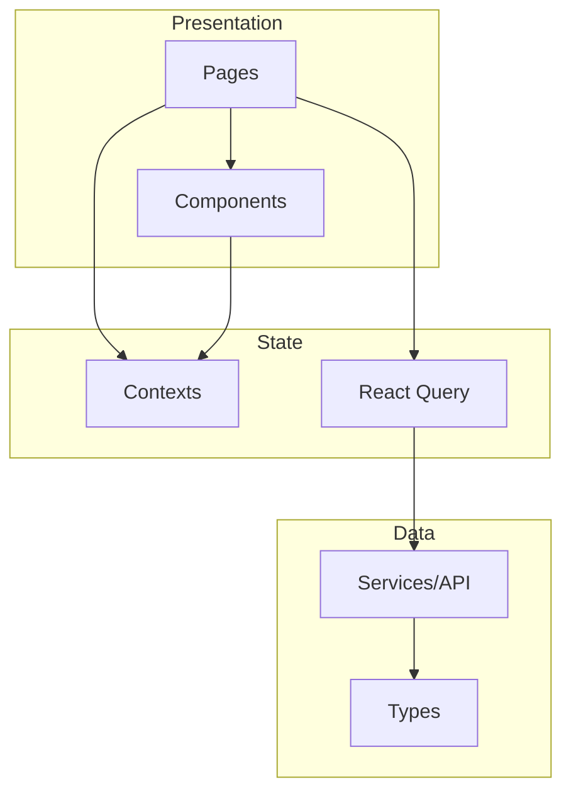

# ADR-002: Arquitetura do Frontend

## Status

**Aceito** - Janeiro 2026

## Contexto

Definir a arquitetura do frontend para garantir escalabilidade, manutencao e organizacao do codigo do sistema Liquid Flow Monitor.

## Decisao

Adotar arquitetura baseada em **Feature-Based Structure** com separacao clara de responsabilidades.

### Estrutura de Pastas

```
src/
├── components/          # Componentes reutilizaveis
│   ├── ui/             # Componentes base (shadcn)
│   ├── Layout.tsx      # Layout principal
│   ├── Sidebar.tsx     # Navegacao
│   └── ...
├── pages/              # Paginas/rotas
│   ├── Dashboard.tsx
│   ├── Tanks.tsx
│   └── ...
├── contexts/           # React Context (estado global)
│   ├── FilterContext.tsx
│   └── ThemeContext.tsx
├── hooks/              # Custom hooks
│   ├── use-mobile.tsx
│   └── use-toast.ts
├── services/           # Camada de API
│   └── api.ts
├── types/              # Tipos TypeScript
│   └── index.ts
├── lib/                # Utilitarios
│   └── utils.ts
├── mocks/              # Dados de demonstracao
│   └── seed.ts
├── App.tsx             # Configuracao de rotas
├── main.tsx            # Entry point
└── index.css           # Estilos globais
```

### Camadas da Arquitetura



### Padroes Adotados

| Padrao | Aplicacao |
|--------|-----------|
| Container/Presentational | Pages = Container, Components = Presentational |
| Custom Hooks | Logica reutilizavel isolada |
| Context API | Estado global (filtros, tema) |
| React Query | Cache e sincronizacao de dados |
| Composition | Componentes compostos via children |

## Consequencias

### Positivas

- Organizacao clara e previsivel
- Facil navegacao no codigo
- Separacao de responsabilidades
- Facilita testes unitarios
- Permite crescimento organico

### Negativas

- Pode gerar muitos arquivos pequenos
- Necessita disciplina para manter padrao
- Context API pode causar re-renders desnecessarios

### Mitigacoes

- Memoizacao com useMemo/useCallback
- Context splitting (contextos menores)
- Code review para manter padroes

## Alternativas Consideradas

### Atomic Design

- **Pros**: Hierarquia clara (atoms, molecules, organisms)
- **Contras**: Pode ser over-engineering para o escopo
- **Decisao**: Rejeitado por complexidade adicional

### Redux

- **Pros**: Estado global robusto, DevTools
- **Contras**: Boilerplate, complexidade para escopo atual
- **Decisao**: Rejeitado - Context + React Query suficiente

### Zustand

- **Pros**: Simples, sem boilerplate
- **Contras**: Mais uma dependencia, Context resolve
- **Decisao**: Rejeitado - Context API nativo suficiente

## Referencias

- [React Patterns](https://reactpatterns.com/)
- [Bulletproof React](https://github.com/alan2207/bulletproof-react)

---

**ADR-002** | Arquitetura Frontend | Janeiro 2026
