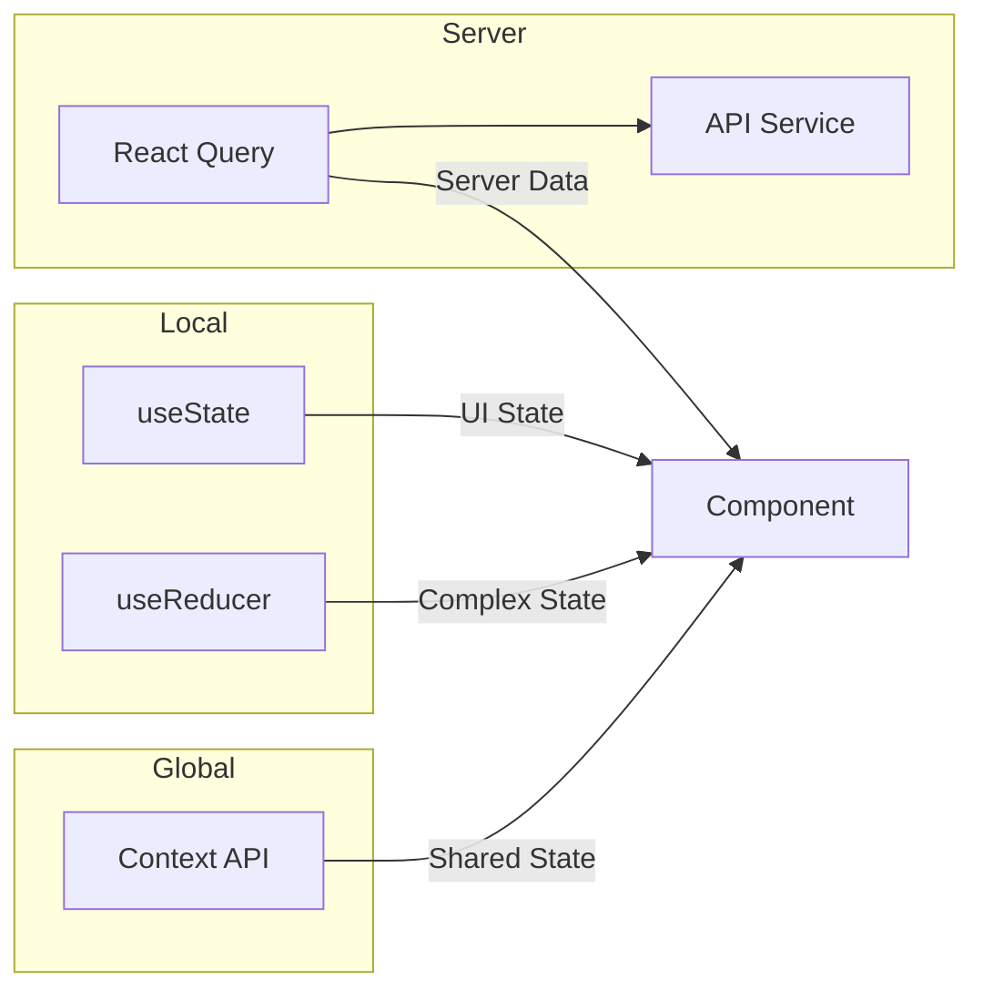

# ADR-003: Gerenciamento de Estado

## Status

**Aceito** - Janeiro 2026

## Contexto

Definir a estrategia de gerenciamento de estado da aplicacao, considerando:

- Estado local de componentes
- Estado global da aplicacao
- Cache de dados do servidor
- Sincronizacao de dados

## Decisao

Adotar estrategia hibrida com tres camadas de estado:

### 1. Estado Local (useState/useReducer)

Para estado que pertence a um unico componente.

```typescript
// Exemplo: estado de modal
const [isOpen, setIsOpen] = useState(false);

// Exemplo: formulario
const [formData, setFormData] = useState<MovementFormData>({
  tankId: '',
  type: 'entrada',
  volume: 0
});
```

### 2. Estado Global (Context API)

Para estado compartilhado entre multiplos componentes.

```typescript
// FilterContext - filtros globais do dashboard
interface FilterContextType {
  filters: DashboardFilters;
  updateFilters: (updates: Partial<DashboardFilters>) => void;
}

// ThemeContext - tema da aplicacao
interface ThemeContextType {
  theme: 'light' | 'dark';
  toggleTheme: () => void;
}
```

### 3. Estado do Servidor (TanStack Query)

Para dados que vem do backend com cache e sincronizacao.

```typescript
// Exemplo: lista de tanques
const { data: tanks, isLoading } = useQuery({
  queryKey: ['tanks'],
  queryFn: () => api.listTanks()
});

// Exemplo: mutacao
const mutation = useMutation({
  mutationFn: api.createMovement,
  onSuccess: () => {
    queryClient.invalidateQueries(['movements']);
    queryClient.invalidateQueries(['tanks']);
  }
});
```

### Diagrama de Fluxo



## Consequencias

### Positivas

- **Separacao clara**: cada tipo de estado tem seu lugar
- **Performance**: React Query gerencia cache inteligente
- **Simplicidade**: Context API sem boilerplate
- **DevTools**: React Query DevTools para debug

### Negativas

- Pode haver duvida sobre onde colocar certo estado
- Context pode causar re-renders se mal estruturado
- Curva de aprendizado do React Query

### Guidelines

| Tipo de Estado | Solucao | Exemplo |
|----------------|---------|---------|
| UI temporario | useState | Modal aberto, input focus |
| Formulario | useState/React Hook Form | Dados do form |
| Compartilhado | Context API | Filtros, tema, usuario |
| Servidor | React Query | Lista de tanques, movimentacoes |
| Cache | React Query | Dados consultados |

## Alternativas Consideradas

### Redux

- **Pros**: Padrao consolidado, DevTools excelente
- **Contras**: Muito boilerplate para o escopo
- **Decisao**: Rejeitado - over-engineering

### MobX

- **Pros**: Reatividade automatica, menos boilerplate
- **Contras**: Paradigma diferente, "magico"
- **Decisao**: Rejeitado - prefere-se explicitude

### Zustand

- **Pros**: Simples, hooks nativos
- **Contras**: Outra dependencia para resolver o que Context faz
- **Decisao**: Rejeitado - Context suficiente

### SWR

- **Pros**: Simples, do time Next.js
- **Contras**: Menos features que React Query
- **Decisao**: React Query escolhido por recursos adicionais

## Configuracao do React Query

```typescript
// queryClient.ts
const queryClient = new QueryClient({
  defaultOptions: {
    queries: {
      staleTime: 5 * 60 * 1000, // 5 minutos
      cacheTime: 10 * 60 * 1000, // 10 minutos
      refetchOnWindowFocus: false,
      retry: 1
    }
  }
});
```

## Referencias

- [TanStack Query Documentation](https://tanstack.com/query)
- [React Context Best Practices](https://react.dev/learn/passing-data-deeply-with-context)

---

**ADR-003** | Gerenciamento de Estado | Janeiro 2026
