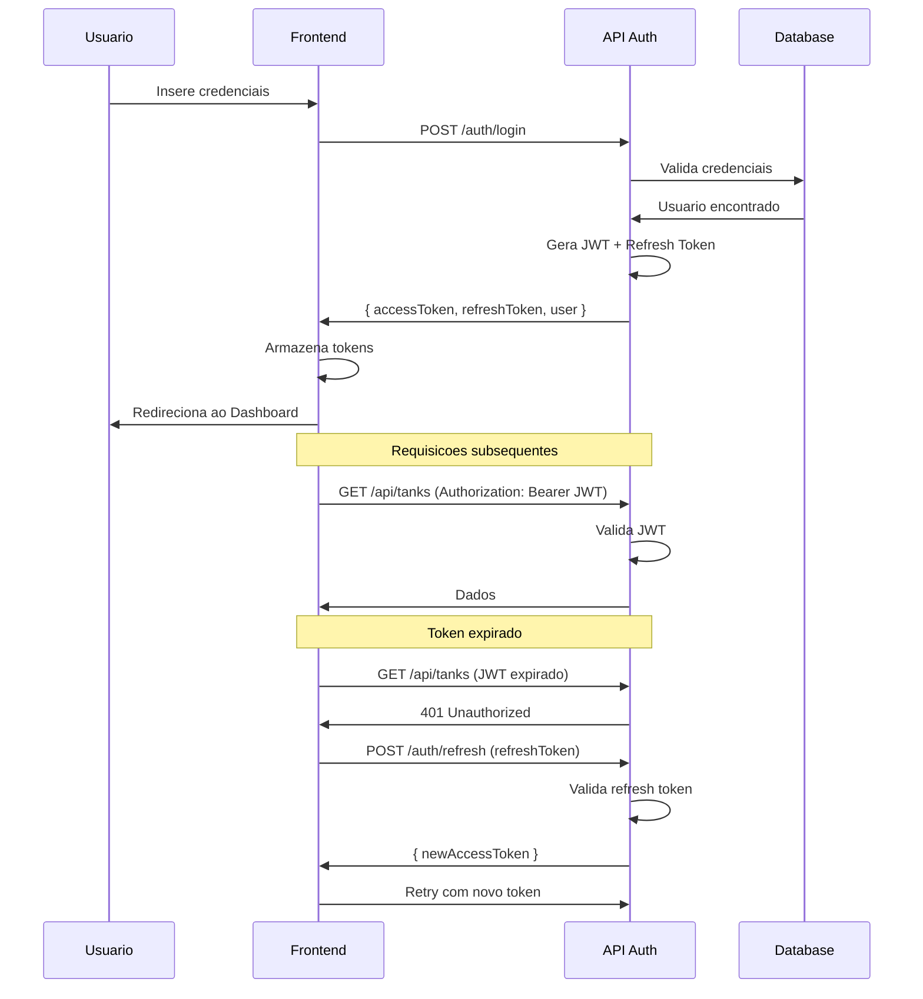

# ADR-004: Estrategia de Autenticacao

## Status

**Proposto** - Janeiro 2026 (Backend pendente)

## Contexto

O sistema necessita de autenticacao segura para controlar acesso as funcionalidades conforme perfil do usuario. A implementacao atual utiliza mock, mas a arquitetura para producao precisa ser definida.

## Decisao

Adotar autenticacao baseada em **JWT (JSON Web Tokens)** com refresh tokens.

### Fluxo de Autenticacao



### Estrutura dos Tokens

#### Access Token (JWT)

```json
{
  "header": {
    "alg": "RS256",
    "typ": "JWT"
  },
  "payload": {
    "sub": "user-uuid",
    "email": "user@example.com",
    "role": "admin",
    "iat": 1704153600,
    "exp": 1704182400
  }
}
```

#### Configuracoes

| Parametro | Valor | Justificativa |
|-----------|-------|---------------|
| Access Token TTL | 8 horas | Dia de trabalho |
| Refresh Token TTL | 7 dias | Reautenticacao semanal |
| Algoritmo | RS256 | Assinatura assimetrica |
| Armazenamento | httpOnly cookie | Protecao XSS |

### Implementacao Frontend

```typescript
// services/auth.ts
interface AuthResponse {
  accessToken: string;
  refreshToken: string;
  user: User;
}

// Interceptor para refresh automatico
api.interceptors.response.use(
  response => response,
  async error => {
    if (error.response?.status === 401) {
      const newToken = await refreshAccessToken();
      error.config.headers.Authorization = `Bearer ${newToken}`;
      return api.request(error.config);
    }
    return Promise.reject(error);
  }
);
```

### Armazenamento de Tokens

| Token | Armazenamento | Motivo |
|-------|---------------|--------|
| Access Token | Memoria (variavel) | Seguranca maxima |
| Refresh Token | httpOnly Cookie | Protegido de XSS |

## Consequencias

### Positivas

- **Stateless**: Servidor nao precisa manter sessao
- **Escalavel**: Qualquer instancia valida o token
- **Padrao de mercado**: Bem documentado e suportado
- **Flexivel**: Payload customizavel

### Negativas

- Complexidade de refresh token
- Token nao pode ser invalidado antes do TTL
- Overhead de validacao em cada request

### Mitigacoes

- Blacklist de tokens (para logout imediato)
- TTL curto para access token
- Rotacao de refresh token

## Alternativas Consideradas

### Session-Based (Cookies)

- **Pros**: Simples, invalidacao imediata
- **Contras**: Stateful, problemas de escalabilidade
- **Decisao**: Rejeitado por escalabilidade

### OAuth 2.0 / OpenID Connect

- **Pros**: Padrao, suporte a provedores externos
- **Contras**: Complexidade desnecessaria para app interna
- **Decisao**: Rejeitado por over-engineering

### API Keys

- **Pros**: Simples para M2M
- **Contras**: Nao adequado para usuarios finais
- **Decisao**: Rejeitado para autenticacao de usuarios

## Seguranca

### Medidas Implementadas

| Medida | Implementacao |
|--------|---------------|
| Password Hash | bcrypt com salt |
| HTTPS | Obrigatorio em producao |
| CORS | Whitelist de origens |
| Rate Limiting | Max 5 tentativas/15min |
| Token Rotation | Refresh token rotacionado |

### Protecoes

- **XSS**: httpOnly cookies
- **CSRF**: SameSite=Strict
- **Brute Force**: Rate limiting + bloqueio temporario

## Endpoints de Autenticacao

| Endpoint | Metodo | Descricao |
|----------|--------|-----------|
| /auth/login | POST | Autenticar usuario |
| /auth/logout | POST | Invalidar sessao |
| /auth/refresh | POST | Renovar access token |
| /auth/me | GET | Dados do usuario atual |
| /auth/password/reset | POST | Solicitar reset |
| /auth/password/change | PUT | Alterar senha |

## Referencias

- [JWT Best Practices](https://auth0.com/docs/secure/tokens/json-web-tokens)
- [OWASP Authentication Cheatsheet](https://cheatsheetseries.owasp.org/cheatsheets/Authentication_Cheat_Sheet.html)

---

**ADR-004** | Autenticacao | Janeiro 2026
