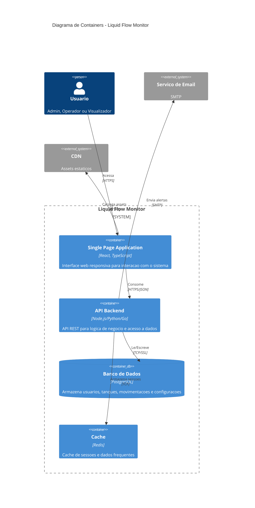
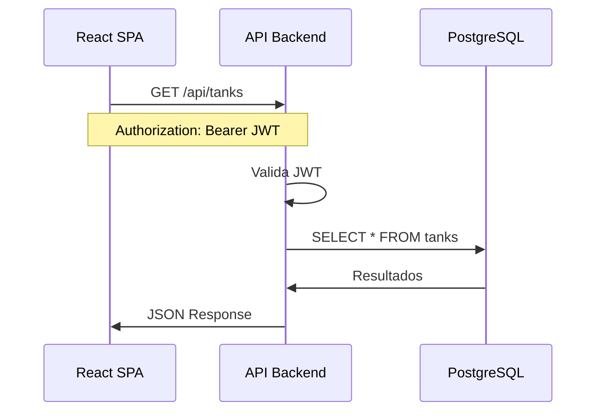
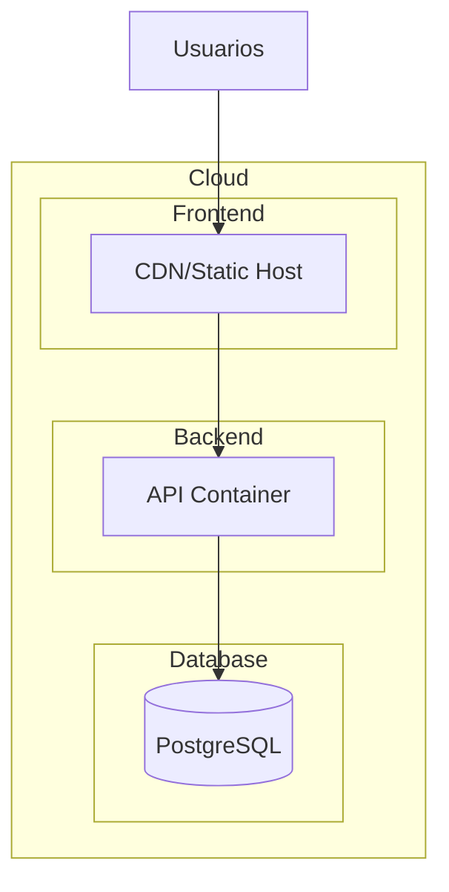
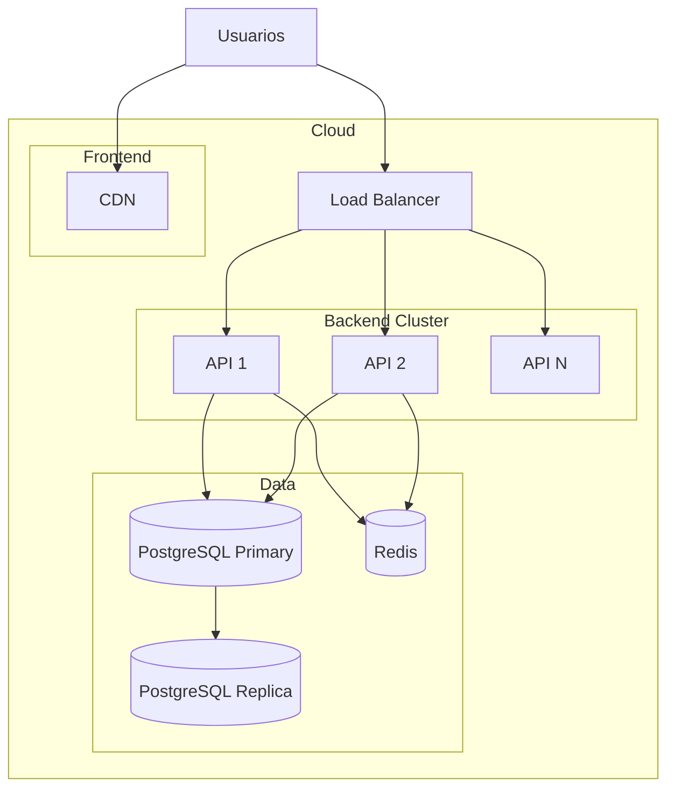
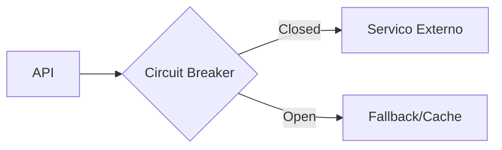

# Diagrama C4 - Nivel 2: Container

## Informacoes Gerais

| Campo | Valor |
|-------|-------|
| **Projeto** | Liquid Flow Monitor |
| **Nivel** | C4 Container (Nivel 2) |
| **Versao** | 1.0 |
| **Data** | Janeiro 2026 |

## 1. Visao de Containers

Este diagrama detalha os containers (aplicacoes, bancos de dados, etc.) que compoem o sistema Liquid Flow Monitor.

## 2. Diagrama de Containers

## 3. Descricao dos Containers

### 3.1 Single Page Application (SPA)

| Aspecto | Especificacao |
|---------|---------------|
| **Tecnologia** | React 18, TypeScript, Vite |
| **Responsabilidade** | Interface do usuario, roteamento client-side |
| **Hospedagem** | CDN / Static Hosting (Vercel, Netlify, S3) |
| **Build** | Bundle otimizado, code splitting |

**Funcionalidades:**
- Dashboard com KPIs e graficos
- Gestao de tanques
- Registro de movimentacoes
- Consulta de historico
- Exportacao de relatorios

### 3.2 API Backend

| Aspecto | Especificacao |
|---------|---------------|
| **Tecnologia** | Node.js (Express/Fastify) ou Go ou Python (FastAPI) |
| **Responsabilidade** | Logica de negocio, validacoes, autenticacao |
| **Hospedagem** | Container (Docker), Cloud Run, ECS |
| **API Style** | REST (JSON) |

**Endpoints Principais:**
- `/auth/*` - Autenticacao
- `/tanks/*` - CRUD de tanques
- `/movements/*` - Movimentacoes
- `/prices/*` - Tabela de precos
- `/users/*` - Gestao de usuarios
- `/reports/*` - Relatorios

### 3.3 Banco de Dados

| Aspecto | Especificacao |
|---------|---------------|
| **Tecnologia** | PostgreSQL 14+ |
| **Responsabilidade** | Persistencia de dados |
| **Hospedagem** | RDS, Cloud SQL, Managed PostgreSQL |
| **Backup** | Diario, retencao 30 dias |

**Tabelas Principais:**
- `users`, `sites`, `tanks`
- `movements`, `price_lists`
- `audit_logs`, `settings`

### 3.4 Cache (Opcional)

| Aspecto | Especificacao |
|---------|---------------|
| **Tecnologia** | Redis |
| **Responsabilidade** | Cache de sessoes, rate limiting |
| **Hospedagem** | ElastiCache, Memorystore |
| **TTL** | Configuravel por tipo de dado |

**Usos:**
- Sessoes de usuario
- Cache de consultas frequentes
- Rate limiting
- Filas de processamento

## 4. Comunicacao entre Containers

### 4.1 Frontend -> Backend

### 4.2 Formatos de Dados

| Comunicacao | Formato | Encoding |
|-------------|---------|----------|
| SPA <-> API | JSON | UTF-8 |
| API <-> DB | SQL | PostgreSQL Protocol |
| API <-> Cache | Binary | Redis Protocol |
| API <-> Email | MIME | SMTP |

## 5. Infraestrutura

### 5.1 Opcao 1: Cloud Simples

### 5.2 Opcao 2: Cloud Escalavel

## 6. Escalabilidade

| Container | Estrategia | Trigger |
|-----------|------------|---------|
| SPA | CDN global | Automatico |
| API | Horizontal (replicas) | CPU > 70%, Requests > N |
| DB | Vertical + Read Replicas | Conexoes, CPU |
| Cache | Cluster Redis | Memoria |

## 7. Resiliencia

### 7.1 Failover

| Componente | Estrategia |
|------------|------------|
| API | Multiple instances + Health checks |
| DB | Failover automatico (managed) |
| Cache | Fallback para DB |

### 7.2 Circuit Breaker

## 8. Seguranca por Container

| Container | Medidas |
|-----------|---------|
| SPA | CSP, SRI, HTTPS only |
| API | JWT, Rate Limit, Input Validation |
| DB | SSL, Firewall, Least Privilege |
| Cache | Auth, Network Isolation |

## 9. Monitoramento

| Aspecto | Ferramenta |
|---------|------------|
| APM | Datadog, New Relic |
| Logs | CloudWatch, Loki |
| Metricas | Prometheus, Grafana |
| Alertas | PagerDuty, OpsGenie |

---

**Documento:** C4-CONTAINER.md
**Ultima Atualizacao:** Janeiro 2026
