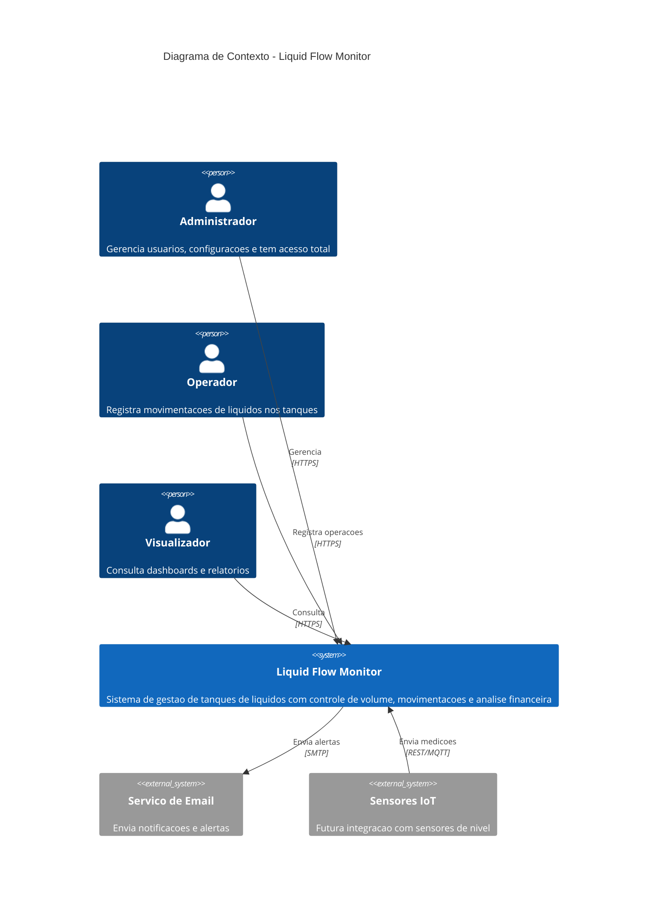
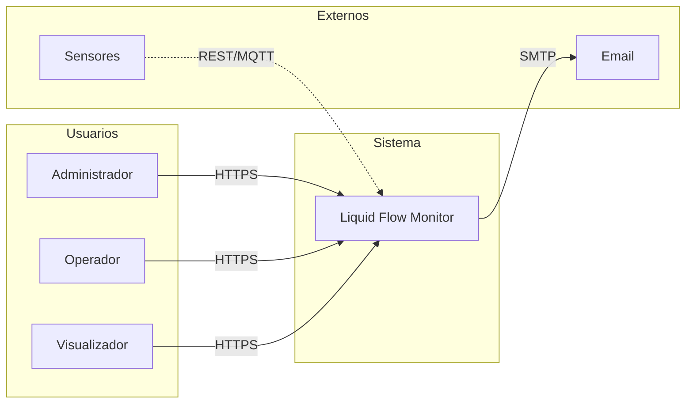

# Diagrama C4 - Nivel 1: Contexto

## Informacoes Gerais

| Campo | Valor |
|-------|-------|
| **Projeto** | Liquid Flow Monitor |
| **Nivel** | C4 Contexto (Nivel 1) |
| **Versao** | 1.0 |
| **Data** | Janeiro 2026 |

## 1. Visao de Contexto

Este diagrama apresenta uma visao de alto nivel do sistema Liquid Flow Monitor e suas interacoes com usuarios e sistemas externos.

## 2. Diagrama de Contexto

## 3. Descricao dos Elementos

### 3.1 Pessoas/Usuarios

| Ator | Descricao | Interacoes |
|------|-----------|------------|
| **Administrador** | Usuario com acesso total ao sistema | Gerencia usuarios, configura parametros, visualiza todos os dados |
| **Operador** | Usuario operacional do dia-a-dia | Registra entradas, saidas e ajustes de volume |
| **Visualizador** | Usuario de consulta | Acessa dashboards, relatorios e historico |

### 3.2 Sistemas

| Sistema | Tipo | Descricao |
|---------|------|-----------|
| **Liquid Flow Monitor** | Sistema Principal | Aplicacao web para gestao de tanques |
| **Servico de Email** | Externo | Sistema para envio de notificacoes |
| **Sensores IoT** | Externo (Futuro) | Dispositivos de medicao automatica |

## 4. Fluxos de Dados

### 4.1 Fluxo Principal

### 4.2 Descricao dos Fluxos

| Origem | Destino | Protocolo | Dados |
|--------|---------|-----------|-------|
| Usuarios | LFM | HTTPS | Credenciais, comandos, consultas |
| LFM | Email | SMTP | Notificacoes, alertas |
| Sensores | LFM | REST/MQTT | Medicoes de nivel (futuro) |

## 5. Requisitos de Integracao

### 5.1 Servico de Email

| Aspecto | Especificacao |
|---------|---------------|
| Protocolo | SMTP/TLS |
| Provider | Configuravel (AWS SES, SendGrid, etc) |
| Eventos | Alerta de estoque baixo, novos usuarios |

### 5.2 Sensores IoT (Roadmap)

| Aspecto | Especificacao |
|---------|---------------|
| Protocolo | REST ou MQTT |
| Autenticacao | API Key por dispositivo |
| Dados | ID sensor, timestamp, volume |
| Frequencia | Configuravel (1-60 min) |

## 6. Consideracoes de Seguranca

### 6.1 Comunicacao

- Todo trafego via HTTPS (TLS 1.3)
- Certificados SSL validos
- HSTS habilitado

### 6.2 Autenticacao

- JWT para usuarios
- API Keys para sistemas externos
- Rate limiting em todos os endpoints

### 6.3 Autorizacao

- RBAC (Role-Based Access Control)
- Principio do menor privilegio
- Auditoria de acoes

## 7. Decisoes Arquiteturais Relacionadas

| ADR | Descricao |
|-----|-----------|
| ADR-001 | Stack Tecnologica |
| ADR-004 | Autenticacao JWT |

## 8. Proximos Niveis

- **C4 Container**: Detalhamento dos containers do sistema
- **C4 Componente**: Detalhamento interno de cada container

---

**Documento:** C4-CONTEXTO.md
**Ultima Atualizacao:** Janeiro 2026
