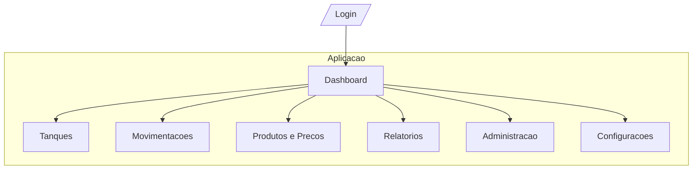
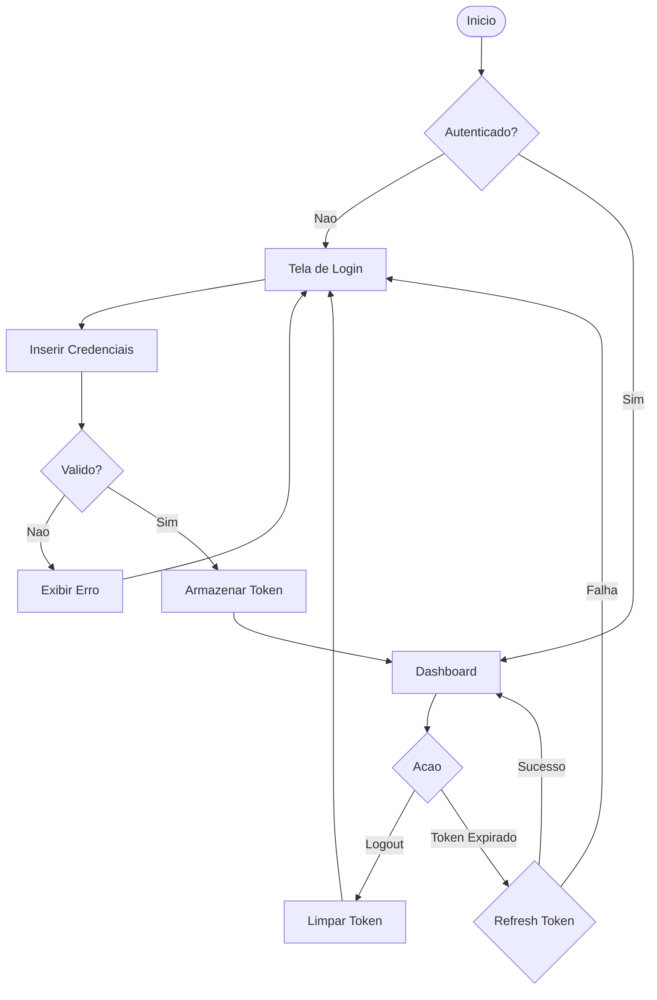
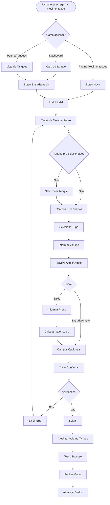
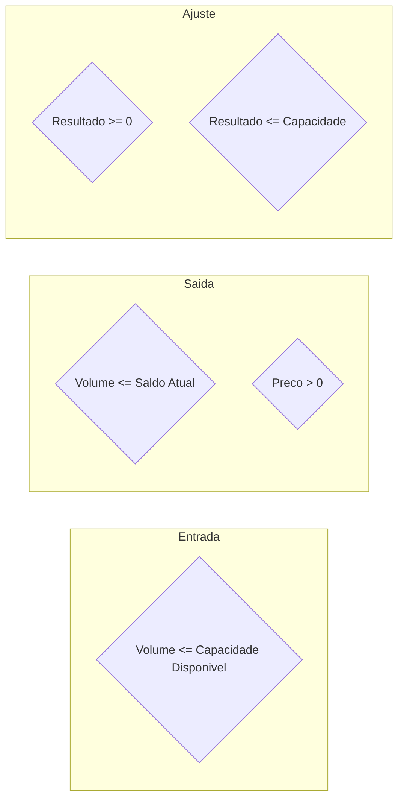
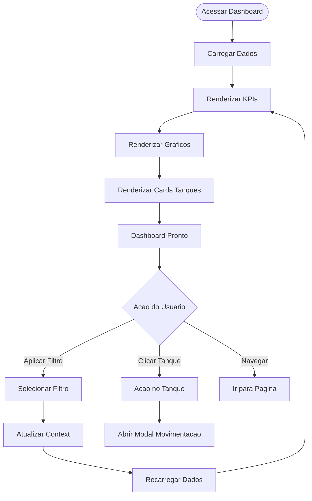
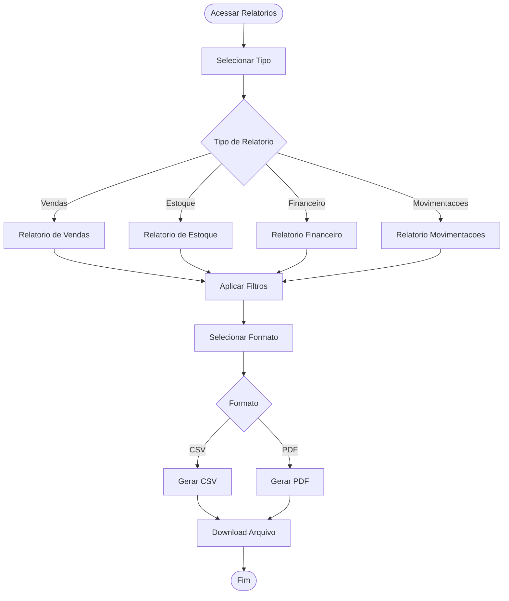
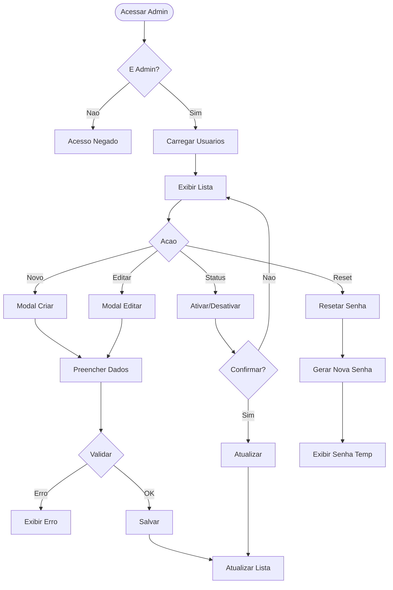
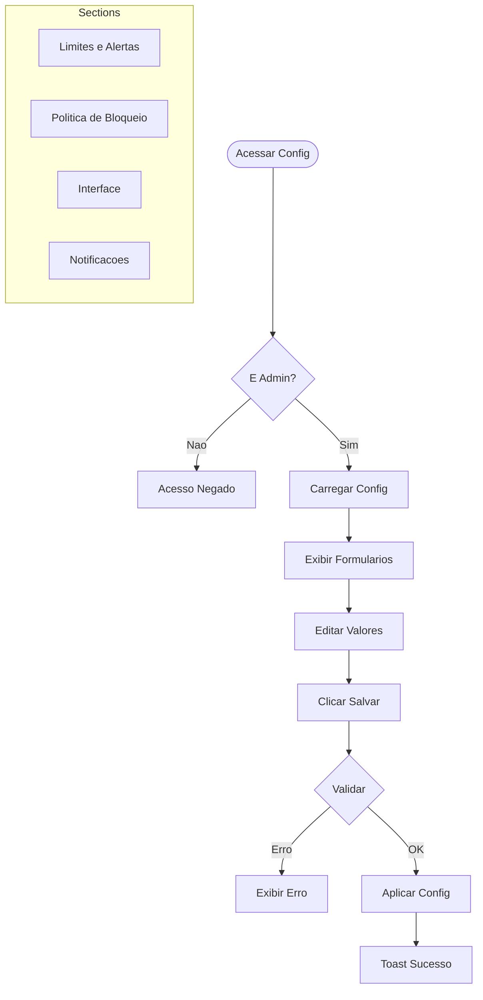
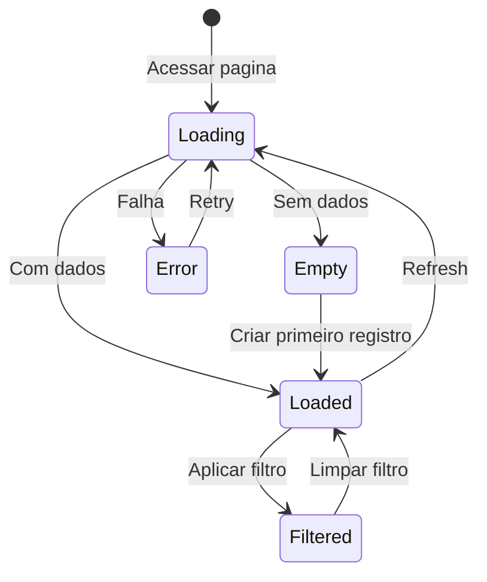
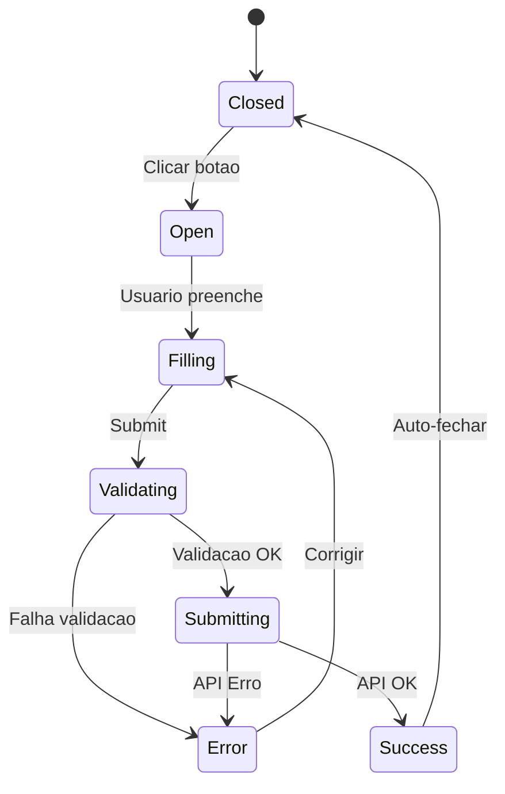

# Fluxos de Navegacao - Liquid Flow Monitor

## Informacoes Gerais

| Campo | Valor |
|-------|-------|
| **Projeto** | Liquid Flow Monitor (TankControl) |
| **Documento** | Fluxos de Navegacao |
| **Versao** | 1.0 |
| **Data** | Janeiro 2026 |

## 1. Mapa do Site

## 2. Estrutura de Navegacao

### 2.1 Menu Principal (Sidebar)

| Ordem | Item | Icone | Rota | Perfis |
|-------|------|-------|------|--------|
| 1 | Dashboard | LayoutDashboard | / | Todos |
| 2 | Tanques | Container | /tanks | Todos |
| 3 | Movimentacoes | ArrowLeftRight | /movements | Todos |
| 4 | Produtos e Precos | DollarSign | /products-prices | Todos |
| 5 | Relatorios | FileText | /reports | Todos |
| 6 | Administracao | Users | /admin | Admin |
| 7 | Configuracoes | Settings | /settings | Admin |

### 2.2 Acoes Rapidas (Topbar)

- Toggle de Tema (Dark/Light)
- Filtros Globais
- Perfil do Usuario
- Logout

## 3. Fluxo de Autenticacao

## 4. Fluxo de Movimentacao

### 4.1 Fluxo Completo

### 4.2 Validacoes do Fluxo

## 5. Fluxo de Dashboard

## 6. Fluxo de Relatorios

## 7. Fluxo de Administracao

### 7.1 Gestao de Usuarios

## 8. Fluxo de Configuracoes

## 9. Estados de Tela

### 9.1 Estados Comuns

### 9.2 Estados do Modal

## 10. Navegacao por Teclado

| Tecla | Acao |
|-------|------|
| Tab | Proximo elemento focavel |
| Shift+Tab | Elemento anterior |
| Enter | Ativar botao/link |
| Space | Toggle checkbox/botao |
| Escape | Fechar modal/dropdown |
| Arrow Up/Down | Navegar em listas |

---

**Documento:** FLOW-navegacao.md
**Ultima Atualizacao:** Janeiro 2026
