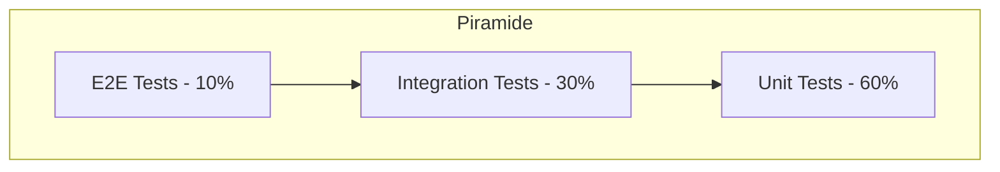

# TP-001: Plano de Testes Geral

## Informacoes Gerais

| Campo | Valor |
|-------|-------|
| **ID** | TP-001 |
| **Nome** | Plano de Testes Geral |
| **Versao** | 1.0 |
| **Data** | Janeiro 2026 |
| **Projeto** | Liquid Flow Monitor |

## 1. Introducao

### 1.1 Objetivo

Este documento define a estrategia, escopo e abordagem de testes para o sistema Liquid Flow Monitor, garantindo qualidade e conformidade com os requisitos.

### 1.2 Escopo

| Incluido | Excluido |
|----------|----------|
| Testes funcionais | Testes de carga em escala |
| Testes de integracao | Testes de penetracao |
| Testes de UI/UX | Auditoria de seguranca |
| Testes de API | Testes de recuperacao |
| Testes de regressao | - |

## 2. Estrategia de Testes

### 2.1 Piramide de Testes



### 2.2 Niveis de Teste

| Nivel | Ferramenta | Responsavel | Cobertura |
|-------|------------|-------------|-----------|
| Unitario | Jest/Vitest | Dev | > 80% |
| Integracao | Jest + MSW | Dev/QA | > 70% |
| E2E | Playwright/Cypress | QA | Fluxos criticos |
| Manual | - | QA | Exploratorio |

## 3. Tipos de Teste

### 3.1 Testes Funcionais

Validam se o sistema atende aos requisitos funcionais.

| Funcionalidade | Prioridade | Casos |
|----------------|------------|-------|
| Autenticacao | Alta | 6 |
| Dashboard | Alta | 8 |
| Gestao Tanques | Alta | 10 |
| Movimentacoes | Critica | 15 |
| Precos | Media | 5 |
| Relatorios | Media | 6 |
| Usuarios | Alta | 8 |
| Configuracoes | Baixa | 4 |

### 3.2 Testes Nao-Funcionais

| Tipo | Objetivo | Criterio |
|------|----------|----------|
| Performance | Tempo de resposta | < 3s carregamento |
| Usabilidade | Facilidade de uso | Task completion > 90% |
| Responsividade | Adaptacao de tela | Funcional em mobile |
| Acessibilidade | WCAG compliance | AA minimo |

### 3.3 Testes de Regressao

Executados a cada release para garantir que funcionalidades existentes nao foram afetadas.

## 4. Ambiente de Testes

### 4.1 Ambientes

| Ambiente | Proposito | Dados |
|----------|-----------|-------|
| Local | Desenvolvimento | Mock |
| Staging | Pre-producao | Anonimizados |
| Production | Smoke tests | Producao |

### 4.2 Dados de Teste

```javascript
// Mock data para testes
const testData = {
  users: [
    { email: 'admin@test.com', role: 'admin' },
    { email: 'operador@test.com', role: 'operador' },
    { email: 'viewer@test.com', role: 'viewer' }
  ],
  tanks: [
    { name: 'TANK-TEST-01', capacity: 10000, volume: 5000 }
  ]
};
```

## 5. Criterios de Entrada e Saida

### 5.1 Criterios de Entrada

- [ ] Codigo commitado e buildavel
- [ ] Ambiente de teste disponivel
- [ ] Dados de teste preparados
- [ ] Casos de teste revisados

### 5.2 Criterios de Saida

- [ ] 100% casos criticos passando
- [ ] > 95% casos de alta prioridade passando
- [ ] Zero bugs criticos abertos
- [ ] Cobertura de codigo > 80%

## 6. Cronograma

| Fase | Atividade | Duracao |
|------|-----------|---------|
| Preparacao | Setup ambiente, dados | - |
| Execucao | Testes funcionais | - |
| Regressao | Testes de regressao | - |
| Report | Documentacao resultados | - |

## 7. Riscos

| Risco | Probabilidade | Impacto | Mitigacao |
|-------|---------------|---------|-----------|
| Ambiente instavel | Media | Alto | Ambiente dedicado |
| Dados inconsistentes | Baixa | Medio | Seeds automaticos |
| Falta de tempo | Media | Alto | Priorizacao |
| Bugs bloqueantes | Media | Critico | Comunicacao rapida |

## 8. Metricas

### 8.1 KPIs de Qualidade

| Metrica | Meta | Formula |
|---------|------|---------|
| Pass Rate | > 95% | Passed / Total |
| Bug Density | < 5/KLOC | Bugs / Lines of Code |
| Coverage | > 80% | Covered / Total |
| Defect Escape | < 2% | Prod Bugs / Total Bugs |

### 8.2 Relatorio de Status

```
+------------------------+
| Status: Em Andamento   |
+------------------------+
| Total Casos: 62        |
| Passando: 55 (89%)     |
| Falhando: 4 (6%)       |
| Bloqueado: 3 (5%)      |
+------------------------+
| Bugs Abertos: 7        |
| - Critico: 0           |
| - Alto: 2              |
| - Medio: 3             |
| - Baixo: 2             |
+------------------------+
```

## 9. Ferramentas

| Ferramenta | Uso |
|------------|-----|
| Vitest | Testes unitarios |
| React Testing Library | Testes de componentes |
| MSW | Mock de APIs |
| Playwright | Testes E2E |
| Lighthouse | Performance |

## 10. Aprovacoes

| Papel | Nome | Aprovacao |
|-------|------|-----------|
| QA Lead | - | Pendente |
| Tech Lead | - | Pendente |
| Product Owner | - | Pendente |

---

**Documento:** TP-001-plano-testes-geral.md
**Ultima Atualizacao:** Janeiro 2026
